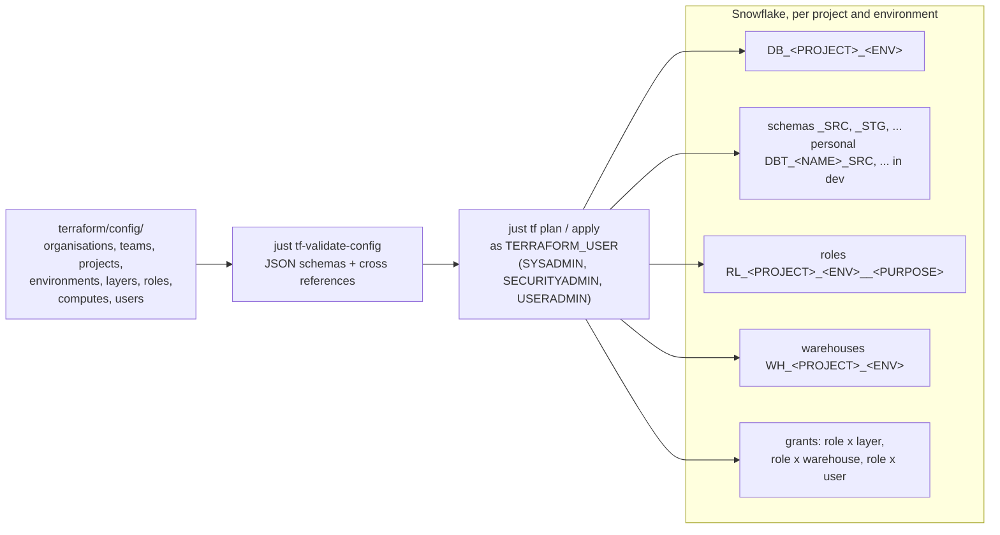

# Administration

Pages for **platform administrators**: the people who own the Snowflake account and turn the
mesh described in `terraform/config/` into databases, schemas, roles and warehouses. Engineers
never need any of this; they get their access from you and then follow
[Getting started](../getting-started/index.md).

## What you own

| Concern | Where it lives | Runbook |
|---------|----------------|---------|
| The one-time account bootstrap: account parameters (UTC, ISO weeks and formats, security defaults), `TERRAFORM_USER` with `SYSADMIN`, `SECURITYADMIN` and `USERADMIN`, `WH_PLATFORM_PROVISIONING`, `DB_PLATFORM_PROVISIONING` and the resource monitor `RM_PLATFORM_PROVISIONING` | `terraform/modules/snowflake/account_settings.sql` (the account parameters) and `init.sql` (the rest), run once as `ACCOUNTADMIN` | [Snowflake provisioning](snowflake-provisioning.md) |
| The mesh: organisation, teams, projects, environments, layers, roles, computes | one YAML file per object under `terraform/config/` | [Snowflake provisioning](snowflake-provisioning.md), [Concepts](../concepts/index.md) |
| Who may assume which project role, and the personal schemas that come with the engineer role in development | `terraform/config/users/<name>.yaml` | [Onboarding](onboarding.md) |
| Key registration for people who cannot set their own key, and for service users | `ALTER USER ... SET RSA_PUBLIC_KEY` | [Onboarding](onboarding.md) |
| Account settings the tooling relies on: the Anaconda terms for Python models | Snowsight, as `ORGADMIN` | [Snowflake provisioning](snowflake-provisioning.md) |
| Terraform state | local `terraform.tfstate` until you move it to a remote backend | [Snowflake provisioning](snowflake-provisioning.md) |
| A test drive on a fresh account: sign-up, MFA, `just setup` | a Snowflake trial | [Snowflake Trial Account setup](snowflake-trial-account-setup.md) |

## How provisioning works

Everything is derived from the YAML. A new project is a copy of
`terraform/config/projects/example.yaml` with its own `code`, which must equal the file name; a
new engineer is a file under `terraform/config/users/`. `just tf plan` shows exactly what
changes before you apply.

## Before the first engineer starts

- [ ] `account_settings.sql` (if you want its account parameters) and `init.sql` have run as `ACCOUNTADMIN`, the latter with the public key of `TERRAFORM_USER` pasted in (`just setup` does this for you on a fresh account, asking about the account parameters first; by hand, `just sf keygen terraform` creates the pair and prints the key body)
- [ ] `TERRAFORM_USER` has a network policy and an encrypted key ([Securing the Terraform user](snowflake-provisioning.md#securing-the-terraform-user))
- [ ] The `TF_VAR_SNOWFLAKE_*` block is in your `.env` (see [Environment variables](../reference/environment-variables.md))
- [ ] `just tf init`, `just tf-validate-config` and `just tf plan` run clean, then `just tf apply`
- [ ] `just tf output database_names` lists `DB_EXAMPLE_DEV` and `DB_EXAMPLE_PRD` (or your own project's databases)
- [ ] An `ORGADMIN` accepted the Anaconda terms, or `int__common__holiday` is disabled in the project
- [ ] Every engineer has a `terraform/config/users/<name>.yaml` with the `engineer` role in `development`, applied: the apply creates their personal schemas, which their first dlt load and dbt run need
- [ ] Every engineer knows the account identifier, their login, `RL_<PROJECT>_DEV__ENG`, `DB_<PROJECT>_DEV` and `WH_<PROJECT>_DEV`
- [ ] You know whether users may set their own `RSA_PUBLIC_KEY`; if not, plan to register keys for them
- [ ] State lives in a remote backend if more than one administrator applies

## Tools you need

Terraform 1.5 or newer; `just tf init` pulls the Snowflake provider (`snowflakedb/snowflake`
2.x) at the version pinned in the committed `terraform/.terraform.lock.hcl`. On top of that,
the same `just` and uv setup engineers use (`just init`): the YAML
validation runs from the repo's virtual environment. It is also a pre-commit hook and a CI job,
so a broken configuration never reaches `main`.

## Terraform commands

| Command | What it does |
|---------|--------------|
| `just tf init` | Initialize providers in `terraform/` |
| `just tf-validate-config` | Validate every YAML file under `terraform/config/` against its JSON schema and the cross references |
| `just tf plan` | Show what would change |
| `just tf apply` | Apply it |
| `just tf output database_names` | The databases Terraform manages |
| `just tf output -json user_role_grants` | Which roles each login holds |
| `just tf output -json personal_schemas` | The personal schemas of each login |
| `just tf output -json initial_passwords` | One-time passwords of persons created with `create: true` |
| `just tf destroy` | Remove everything Terraform created; the `init.sql` objects stay. Databases carry `prevent_destroy`, so it fails until you delete that block ([State and teardown](snowflake-provisioning.md#state-and-teardown)) |
