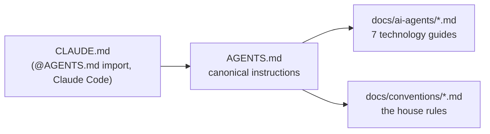

# Working on this repo with AI agents

This repo is built to be worked on by AI coding agents: one canonical instruction file, `AGENTS.md`, plus the per-technology guides in this section. This page explains how those pieces fit together. Read it whether you *are* an agent or a human prompting one.

## How the repo talks to agents

Every agent entry point ends up at the same file, so instructions cannot drift between tools:



| File | Consumed by | What it is |
|---|---|---|
| `AGENTS.md` | Every agent | Behavior rules, project overview, the platform model, directory map, commands, conventions, pitfalls. Agents read it completely before making changes. |
| `CLAUDE.md` | Claude Code | One line, `@AGENTS.md`, which Claude Code reads as an import. Nothing lives there on its own. |
| `docs/ai-agents/*.md` | Every agent | The per-technology guides in this section (see the [table below](#skill-pages)). |
| `docs/conventions/*.md` | Every agent | The canonical rules; the guides link to them instead of restating them. |

!!! tip "Keep it that way"
    Project rules go only in `AGENTS.md`. `CLAUDE.md` stays the single line `@AGENTS.md`, an import rather than a symlink, because a Windows checkout (`core.symlinks=false`) turns a symlink into a 9-byte text file.

No MCP servers are configured in this repo; agents inspect Dagster, dbt, dlt and Snowflake through the `just` recipes and by reading files.

## The model in three sentences

The full story is under [Concepts](../concepts/index.md); this is the minimum an agent needs before touching anything.

1. An **Organisation** has **Teams**, a Team owns **Projects**, a Project exists in **Environments** (`dev`, `tst`, `acc`, `prd`), and each Project × Environment has **Layers** (schemas), **Roles** (grants) and **Computes** (warehouses). Users assume project roles.
2. In Snowflake that is one database `DB_<PROJECT>_<ENV>` per Project × Environment, layer schemas `_SRC`, `_REF`, `_STG`, `_INT`, `_MRT`, `_EXP`, `_MTD`, `_TMP`, roles `RL_<PROJECT>_<ENV>__<PURPOSE>` (`ENG`, `ANL`, `ING`, `TFM`) and warehouses `WH_<PROJECT>_<ENV>`. The starter ships one project, `example`, so the development database is `DB_EXAMPLE_DEV`.
3. In `dev` every engineer works in personal schemas `<SNOWFLAKE_SCHEMA>_<LAYER>` (`DBT_USERNAME_STG`) of the shared development database, which Terraform provisions per engineer (dlt and dbt cannot create schemas); the other environments use the provisioned `_<LAYER>` schemas.

Two personas use the repo. **Engineers** write dlt pipelines, dbt models and Dagster code and never run Terraform. **Platform administrators** run Terraform against the YAML under `terraform/config/` ([Administration](../administration/index.md)). Agents almost always act for an engineer; the [Snowflake guide](snowflake.md) covers what an agent may touch on the administrator side.

## The rules agents must follow

Distilled from `AGENTS.md`. These are hard rules, not suggestions.

!!! danger "Git is human-only"
    Agents never run `git commit`, `git push`, or create branches. Humans do all git writes (see the [git workflow](../conventions/git-workflow.md)). Read-only git commands (`git status`, `git diff`, `git log`) are fine.

**Validate before presenting**
:   Run `just fmt`, `just typecheck`, `just test` and `just validate` and make them pass before showing work. Each skill page lists the extra validation for its technology.

**Minimal changes**
:   Do what was asked, nothing more. No drive-by refactors, no unsolicited docstrings, no "while I'm here" improvements. One thing at a time; keep diffs small.

**Type hint everything**
:   Every function signature gets full annotations, parameters and return type. Python 3.13 style: `X | None`, not `Optional[X]`.

**Follow existing patterns**
:   Assets, resources, models and tests all have an established shape here. Check `dlt_pipelines/`, `src/orchestrator/` and `dbt/` before inventing anything new.

**Never bypass pre-commit**
:   No `--no-verify`. If a hook fails, fix the underlying issue.

**No over-engineering**
:   Solve the problem at hand. No speculative abstractions, no helper extraction after three repeats in the same file, no class where a function will do.

**Never hardcode credentials**
:   `SNOWFLAKE_*` comes from `.env`, written by `just sf setup`. See [environment variables](../reference/environment-variables.md).

**Challenge, don't comply**
:   Push back when an approach is suboptimal, ask why before implementing something that seems wrong, suggest alternatives, flag risks. Honest disagreement beats agreeable debt.

### The validation loop

=== "just"

    ```bash
    just fmt        # ruff format + ruff check --fix + sqlfluff fix
    just typecheck  # ty check
    just test       # pytest
    just validate   # dagster definitions validate -w workspace.yaml
    ```

=== "What runs underneath"

    ```bash
    uv run ruff format .
    uv run ruff check --fix .
    cd dbt/dbt_example && uv run sqlfluff fix models --config ../.sqlfluff
    uv run ty check
    uv run pytest
    uv run dagster definitions validate -w workspace.yaml
    ```

Depending on what you touched, add:

| Touched | Also run |
|---|---|
| dbt models, sources, seeds, macros | `just dbt parse`, then `just dbt build` (needs your `.env`) |
| `terraform/config/*.yaml` | `just tf-validate-config` |
| `docs/` or `mkdocs.yml` | `just docs build --strict` |

`just check` runs what CI runs in one go: lint, typecheck, tests, `dbt parse` in every project with the `dummy` target, the Dagster validation and the Terraform YAML validation.

See the [command reference](../reference/commands.md) for every recipe and [testing](../development/testing.md) for what the test suite covers.

## Skill pages

Each guide covers one technology: concepts, the patterns in this repo, and the validation commands to run after touching that layer. Read the one matching the code you are changing.

| Skill page | Scope |
|---|---|
| [Standards](standards.md) | Pre-commit hooks, CI, where each rule lives, the validation loop |
| [Dagster](dagster.md) | Code locations and `workspace.yaml`, components, assets, jobs, resources |
| [dbt](dbt.md) | The projects, the `dbt_common` package, layers, model and test patterns |
| [dlt](dlt.md) | Ingest pipelines, the source layer, the Snowflake destination, the Dagster component |
| [Snowflake](snowflake.md) | The platform model in Snowflake, key-pair auth, naming, the settings object, shared macros, Terraform |
| [Python](python.md) | Style, type hints, test patterns, dependencies (uv) |
| [SQL](sql.md) | Formatting, sqlfluff rules, Jinja patterns, templates |

## Feeding these docs to an agent

The site is plain Markdown under `docs/`, built by Zensical from `mkdocs.yml`. An agent working in a clone reads the pages directly; `AGENTS.md` links to them by path, so *"follow `docs/ai-agents/dbt.md`"* works without a running site. `just docs` serves the rendered site on port 8000 for humans.

## Tips for humans prompting agents

Agents load `AGENTS.md` automatically (through `CLAUDE.md`), but targeted prompts get better results:

- **Name the skill page** for the technology you are touching: *"Follow `docs/ai-agents/dbt.md` and add an INT model for ..."*. That pulls the layer rules and validation commands into context immediately.
- **Ask for the validation loop explicitly**: *"Run `just fmt`, `just test` and `just validate` before presenting."* Agents must do this anyway, but asking makes skipped checks visible.
- **One task per session.** The rules forbid bundled changes; prompts that ask for three things produce diffs that are hard to review.
- **You commit, not the agent.** Expect a finished working tree, review the diff, then commit and push yourself following the [git workflow](../conventions/git-workflow.md).
- **Expect pushback.** The instructions tell agents to challenge weak approaches. If an agent says your plan breaks the [layer rules](../conventions/dbt-style-guide.md) or an existing pattern, that is the system working.
- **Point at examples.** *"Do it like the `knmi` pipeline"* or *"mirror `stg__knmi__climate_hourly`"* beats describing a pattern from scratch.
- **Say which environment.** The default is `dev` with personal schemas. If a change is about `tst`, `acc` or `prd` behavior (the `_<LAYER>` schemas, the system users), say so; the agent cannot see those from a laptop.

!!! note "First time setting up?"
    An agent can only run the validation loop if the project is installed: [installation](../getting-started/installation.md) (`just init`) covers the offline part. Anything that touches Snowflake (`just dbt build`, `just dlt run knmi`, `just sf check`) needs the `.env` written by [`just sf setup`](../getting-started/snowflake-auth.md), which requires a human at the keyboard for the one-time login. Without a filled `.env`, set `DBT_TARGET=dummy` (the line is ready to uncomment in `.env.example`) so `just validate` parses dbt against an in-memory DuckDB, exactly as CI does.
