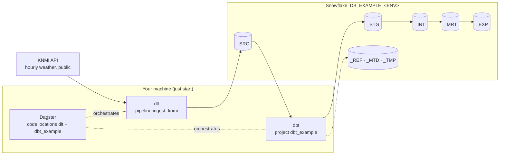

# Architecture

One small platform with the shape of a big one: **Dagster** orchestrates, **dlt** ingests into
**Snowflake**, **dbt** transforms inside Snowflake, **Terraform** provisions the Snowflake side.
An engineer runs all of it from one repository on their own machine, against a project
database that Terraform created. This page is the map. The other pages in this section each go
deep on one part; the model behind the names is on [Concepts](../concepts/index.md).

## The platform in one diagram



1. **dlt** fetches the last 30 days of hourly observations for seven KNMI stations and merges
   them into `knmi__climate_hourly` in the source layer. The pipeline is
   `dlt_pipelines/pipelines/ingest/knmi/`.
2. **dbt** declares that table as a source and builds the layers `_STG`, `_INT`, `_MRT` and
   `_EXP`. Seeds go to `_REF`, run metadata to `_MTD`, stored test failures to `_TMP`. The
   project is `dbt/dbt_example/`, with the shared `dbt/dbt_common/` package installed into it.
3. **Dagster** shows both as one asset graph. The dlt asset `dlt/ingest/knmi/climate_hourly`
   feeds the dbt asset `stg/stg__knmi__climate_hourly`, even though the two live in different
   code locations. `workspace.yaml` lists those locations.

Everything lands in one database per environment, `DB_EXAMPLE_<ENV>`. In development the
database is shared and every engineer works in personal schemas, `DBT_<NAME>_<LAYER>`; in the
other environments the tools write to the provisioned `_<LAYER>` schemas.

## Components

| Component | Role | Where in the repo | Detail |
|-----------|------|-------------------|--------|
| Dagster | Orchestrates everything. One code location per concern, loaded from `workspace.yaml`. Local instance state in `.dagster/` | `src/orchestrator/locations/`, `workspace.yaml`, `.dagster/dagster.yaml` | [Orchestration](orchestration.md) |
| dlt | Ingests REST sources into the source layer as `<source>__<entity>` tables. One folder per source with a module-level `source` and `pipeline` | `dlt_pipelines/`, `.dlt/config.toml` | [Ingestion](ingestion.md) |
| dbt | Transforms inside Snowflake through numbered layer folders. Shared `profiles.yml`, a `dbt_common` package and one project per mesh node | `dbt/` | [Transformation](transformation.md) |
| Snowflake | The project databases, roles and warehouses. Key-pair authentication, one settings reader | `.env`, `src/orchestrator/resources/snowflake.py`, `dbt/profiles.yml` | [Snowflake](snowflake.md) |
| Terraform | Turns the YAML under `terraform/config/` into Snowflake objects. Platform administrators only | `terraform/` | [Snowflake provisioning](../administration/snowflake-provisioning.md) |

## How each tool implements the concepts

Terraform
:   Reads `terraform/config/` and creates, per project and environment, a database
    `DB_<PROJECT>_<ENV>`, a schema `_<LAYER>` per layer, a role
    `RL_<PROJECT>_<ENV>__<PURPOSE>` per role with grants per layer and compute, and a warehouse
    `WH_<PROJECT>_<ENV>[__<COMPUTE>_<SIZE>]` per compute and size. Users get role grants.

dbt
:   One dbt project per Project (`dbt/dbt_example`). The shared profile `default` has one
    target per environment and follows `ENVIRONMENT`. Each layer folder carries a `+schema`
    (`stg`, `int`, `mrt`, `exp`, `ref`, `tmp`) and `dbt_common.generate_schema_name` turns it
    into `_<LAYER>`, or `<SNOWFLAKE_SCHEMA>_<LAYER>` in `dev`.

dlt
:   Every pipeline loads into the source layer: `source_dataset()` returns `_SRC` or
    `<SNOWFLAKE_SCHEMA>_SRC`, and the table is named `<source>__<entity>`. Role, warehouse and
    database come from the same `SNOWFLAKE_*` variables as everything else.

Dagster
:   One code location per concern: `dlt` for every load, `dbt_<project>` per dbt project. Asset
    keys carry the layer (`stg/stg__knmi__climate_hourly`) or the load
    (`dlt/ingest/knmi/climate_hourly`). Dagster runs with the same `.env`, so it works in the
    environment the checkout is configured for.

## Repository layout

```
workspace.yaml                    # the authoritative list of Dagster code locations
justfile                          # every command (run bare `just` to list them)
.env.example                      # ENVIRONMENT, SNOWFLAKE_*, DBT_TARGET, RUNTIME__LOG_LEVEL, TF_VAR_SNOWFLAKE_*
src/orchestrator/                 # Dagster package
├── locations/dlt/definitions.py  #   code location "dlt": the dlt_pipelines component tree
├── locations/dbt/shared.py       #   build_dbt_defs(): one code location per dbt project
├── locations/dbt/dbt_example/    #   code location "dbt_example": definitions.py + defs/dbt/defs.yaml
├── resources/snowflake.py        #   SnowflakeSettings.from_env(): the only reader of SNOWFLAKE_* and ENVIRONMENT
└── utils/dotenv.py               #   .env editing used by scripts/snowflake.py
dlt_pipelines/                    # dlt package
├── __main__.py                   #   `just dlt list` / `just dlt run <source>`
├── pipelines/ingest/knmi/        #   constants.py, source.py, pipelines.py, defs.yaml
└── utils/destination.py          #   the Snowflake destination and the source-layer dataset
dbt/
├── profiles.yml                  #   shared profile `default`: dev, prd + dummy
├── .sqlfluff                     #   shared lint config: dbt templater with the dummy target
├── dbt_common/                   #   package: macros, generic tests, seeds, generic dims
└── dbt_example/                  #   project: models/02_stg 03_int 04_mrt 05_exp, sources/, seeds/
terraform/                        # platform administrators: config/*.yaml -> Snowflake
├── README.md                     #   the runbook
├── config/                       #   organisations, teams, projects, environments, layers, roles, computes, users, privileges
├── modules/snowflake/            #   database, schema, role, warehouse and grant modules; init.sql (bootstrap)
└── main.tf users.tf variables.tf outputs.tf providers.tf
scripts/                          # snowflake.py (key pairs), info.py, dbt_all.py
tests/                            # pytest, offline only
.dagster/dagster.yaml             # DAGSTER_HOME (state is git-ignored, this file is not)
.dlt/config.toml                  # dlt runtime settings (no credentials)
docs/ + mkdocs.yml                # this site
```

## How the pieces connect

One settings reader
:   `SnowflakeSettings.from_env()` in `src/orchestrator/resources/snowflake.py` reads the
    `SNOWFLAKE_*` variables and `ENVIRONMENT` from `.env`. The dlt destination, the Dagster
    Snowflake resource and `scripts/snowflake.py` all go through it; `dbt/profiles.yml` reads
    the same variable names with `env_var()`. When a connection fails, there is one place to
    look.

One environment file
:   `just` loads `.env` into every recipe and exports `DAGSTER_HOME`, `DLT_PROJECT_DIR`,
    `DLT_DATA_DIR` and `DBT_PROFILES_DIR` itself. `.envrc` does the same for direnv users. See
    [Environment variables](../reference/environment-variables.md).

One schema rule, implemented twice
:   `SnowflakeSettings.schema_for_layer()` (Python) and `dbt_common.generate_schema_name`
    (Jinja) both map a layer to `_<LAYER>`, or to `<SNOWFLAKE_SCHEMA>_<LAYER>` in `dev`. The
    dbt source YAML repeats the rule with `env_var`, because source YAML cannot call macros.

Shared asset keys, no imports
:   The Dagster code locations load in separate subprocesses and never import each other. The
    dbt source `knmi.climate_hourly` carries `config.meta.dagster.asset_key: ["dlt", "ingest",
    "knmi", "climate_hourly"]`, the exact key the dlt component produces, so Dagster draws the
    edge between them.

## Detail pages

| Page | Covers |
|------|--------|
| [Layers in practice](layers.md) | What each layer holds in this repo, the folder-to-schema mapping, the naming rule, the reference rule, the `dbt_common` dimensions |
| [Ingestion (dlt)](ingestion.md) | Source, resource and pipeline, merge on a primary key, the Snowflake destination, the Dagster component, the standalone runner |
| [Transformation (dbt)](transformation.md) | The shared profile and its targets, the `dbt_common` package, the `dbt_example` project, hooks and run metadata |
| [Orchestration (Dagster)](orchestration.md) | `workspace.yaml`, code locations, component trees, asset keys, jobs, the local instance |
| [Snowflake](snowflake.md) | What Terraform creates, naming, personal schemas, key-pair authentication, the settings reader |

Ready to change something? The [Development](../development/index.md) section has a how-to per
kind of change.
