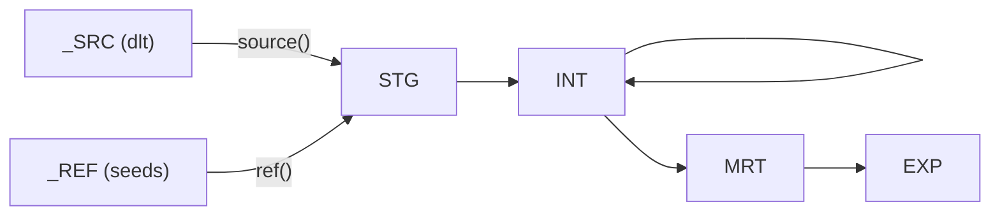
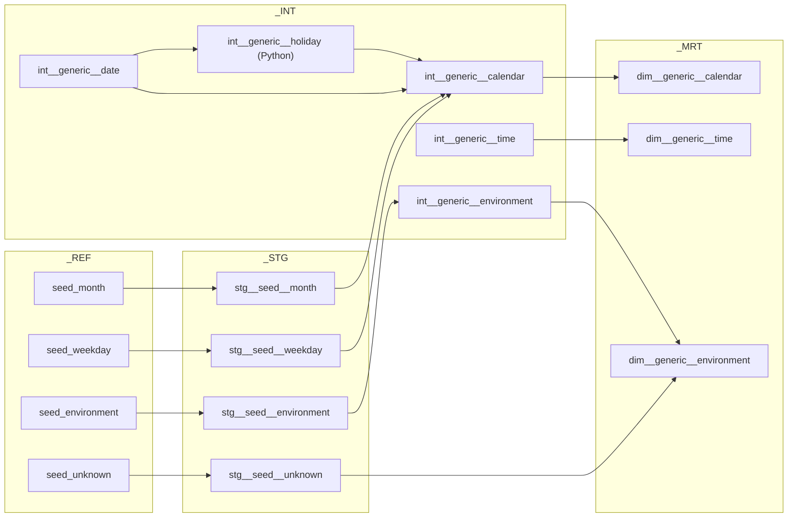

# Layers in practice

[Layer](../concepts/layer.md) explains what the layers mean. This page is the schema-level cut
through this repo: which layer holds what, which folder writes it, how it materializes, how
the schema gets its name, and the one rule that keeps the graph readable. The dbt projects
themselves are on [Transformation](transformation.md).

## The map

All of this sits inside the project database, `DB_EXAMPLE_<ENV>`.

| Layer | Written by | Folder | `+schema` | Schema (shared) | Schema (`dev`) | Materialization | Name pattern |
|-------|-----------|--------|-----------|-----------------|----------------|-----------------|--------------|
| Source | dlt | `dlt_pipelines/pipelines/ingest/<source>/` | (dataset) | `_SRC` | `<PREFIX>_SRC` | table, `merge` on the primary key | `<source>__<entity>` (`knmi__climate_hourly`) |
| Reference | `dbt seed` | `seeds/` | `ref` | `_REF` | `<PREFIX>_REF` | seed table | `seed_<name>` |
| Staging | dbt | `models/02_stg/` | `stg` | `_STG` | `<PREFIX>_STG` | table | `stg__<source>__<entity>` |
| Integration | dbt | `models/03_int/` | `int` | `_INT` | `<PREFIX>_INT` | table | `int__<domain>__<entity>` |
| Mart | dbt | `models/04_mrt/` | `mrt` | `_MRT` | `<PREFIX>_MRT` | table | `dim__`, `fct__`, `brg__`, `agg__` |
| Expose | dbt | `models/05_exp/` | `exp` | `_EXP` | `<PREFIX>_EXP` | view | `exp__<domain>__<entity>` |
| Metadata | `dbt_common` `on-run-end` hook | none | `mtd` (in the macro) | `_MTD` | `<PREFIX>_MTD` | tables created on demand | `pre__dbt__<dataset>` |
| Temporary | dbt data tests | none | `tmp` | `_TMP` | `<PREFIX>_TMP` | `store_failures` tables | test names |

`<PREFIX>` is `SNOWFLAKE_SCHEMA` from `.env`, `DBT_<NAME>` by convention (`DBT_INFO`).
Materializations come from `dbt/dbt_example/dbt_project.yml` (`dbt_common` builds `03_int`
as `view` by default, with the date, calendar, time and holiday models overriding to
`table`); a model can override its folder default with `config(materialized=...)`.

Every layer folder tags its models (`layer=stg`, `layer=int`, `layer=mrt`, `layer=exp`), so a
whole layer selects in one go:

```bash
just dbt ls --select tag:layer=stg
just dbt build --select stg__knmi__climate_hourly+
```

## The schema naming rule

A layer's schema depends on the environment. The rule lives in
`dbt/dbt_common/macros/generate_schema_name.sql` for dbt and in
`SnowflakeSettings.schema_for_layer()` for dlt and Dagster, and both say the same thing:

| Target | `target.schema` | `+schema` | Result |
|--------|-----------------|-----------|--------|
| `dev` | `DBT_INFO` | `stg` | `DBT_INFO_STG` |
| `dev` | `DBT_INFO` | (none) | `DBT_INFO` |
| `prd` | `_TMP` | `stg` | `_STG` |
| `prd` | `_TMP` | (none) | `_TMP` |

In the shared environments (`tst`, `acc`, `prd`) a layer's schema is `_<LAYER>`, provisioned by
Terraform. In `dev` every engineer works in personal schemas, `<target.schema>_<LAYER>`, created
on demand, so several people share one development database without stepping on each other.
The `dummy` target counts as personal too. The macro only takes effect because
`dbt/dbt_example/dbt_project.yml` puts `dbt_common` first in the dispatch order:

```yaml title="dbt/dbt_example/dbt_project.yml (excerpt)"
dispatch:
  - macro_namespace: dbt
    search_order: ["dbt_common", "dbt"]
```

Models without any `+schema` land in `target.schema`: your prefix in `dev`, and `_TMP` in the
shared environments (the `profiles.yml` fallback when `SNOWFLAKE_SCHEMA` is unset). Nothing
should end up there.

Source YAML cannot call macros, so `dbt/dbt_example/sources/src_knmi.yml` spells the rule out
with `env_var`:

```yaml title="dbt/dbt_example/sources/src_knmi.yml (excerpt)"
schema: "{{ env_var('SNOWFLAKE_SCHEMA', '') if env_var('ENVIRONMENT', 'dev') in ['dev', 'dummy'] else '' }}_SRC"
```

Keep the two in step when you touch either.

## The reference rule

A model references only the layer directly below it. Staging reads sources and seeds;
integration reads staging (and other integration models); mart reads integration; expose reads
mart.



| Layer | May reference |
|-------|---------------|
| STG | `source()` tables in `_SRC`, seeds in `_REF` |
| INT | `stg__` models, other `int__` models |
| MRT | `int__` models; dimensions for a fact's foreign keys; `stg__seed__unknown` for the unknown member |
| EXP | mart models |

!!! warning "Tempted to skip a layer?"
    - An INT model wants a raw column: add it to the staging model first. Staging is cheap and
      it keeps the cast boundary in one place.
    - Two models repeat the same CTE: make it its own model in the right layer.
    - An EXP view is growing business rules: push them down to INT or MRT. EXP selects,
      filters and joins a star back together; it does not compute new truth.

    The rule is checked in review, not by a tool, so it is worth internalizing.

## Layer by layer

### Source: what dlt landed

One table per dlt resource, named `<source>__<entity>`, columns exactly as the API returned
them (lowercased by dlt) plus dlt's own bookkeeping columns such as `_dlt_load_id`. dlt keeps
its state tables in the same schema, which is how pipeline state comes back when you delete
`.dlt/data/`.

dbt never writes here. It reads the tables through a `src_<source>.yml` in
`dbt/dbt_example/sources/`, which names the table with `identifier: knmi__climate_hourly` and
pins the Dagster asset key of the dlt asset. See [Ingestion](ingestion.md).

What does not belong: renames, casts, fixes. Those are staging's job.

### Reference: seeds

CSV files under `seeds/`, loaded by `dbt seed` (part of `dbt build`). `dbt_common` ships four:
`seed_environment`, `seed_month`, `seed_weekday` and `seed_unknown` (the unknown-member rows
with ids `-1`, `-2`, `-3`). `dbt_common` seeds use `+full_refresh: true`, so the table always
matches the file. Seeds arrive untyped, which is why each one has a typed `stg__seed__<name>`
model in `02_stg/seed/`; downstream models reference the staging model, not the seed.

### Staging: typed and renamed

One model per source table. Cast every column, give it a business name, convert units, keep
the grain. `stg__knmi__climate_hourly` is the whole pattern: `t` in tenths of a degree becomes
`temperature_celsius`, KNMI's hour `1..24` becomes an `observed_at` timestamp, `-1` for "less
than 0.05 mm" becomes `0.05`.

Materialized as `table`. No joins, no business logic, read only by INT.

### Integration: business logic

Organized by domain, not by source. Joins, enrichment, derived measures, reusable building
blocks. `dbt_example` has no INT models yet (the folder holds a `.gitkeep`); the
[Adding a dbt model](../development/adding-dbt-models.md) walkthrough builds the first one.
`dbt_common` contributes the generic chain described below.

Materialized as `table` in `dbt_example`. Read by MRT and other INT models.

### Mart: the dimensional model

Dimensions (`dim__`), facts (`fct__`), bridges (`brg__`) and aggregates (`agg__`). The
`dbt_common` dimensions show the house pattern: a surrogate key named `id_<model>` as the first
column (`id_dim__generic__calendar` is the `YYYYMMDD` integer), and a `UNION ALL` with
`stg__seed__unknown` so every fact can point at an unknown member instead of a `NULL`.

Materialized as `table`. Consumer-specific shaping belongs one layer up.

### Expose: the contract

Views that give a named consumer, or another project, the flat shape it wants. This is the
publication boundary of the project: other projects read `_EXP` and nothing else.
`dbt_example` has none yet. Materialized as `view`, so they are always current.

### Metadata and Temporary: bookkeeping

Neither is a modeling layer, but both show up after a `dbt build`.

`_MTD` holds run metadata. `dbt_common`'s `on-run-end` hook calls `upload_results(results)`
after every `run`, `build`, `test`, `seed` and `freshness` invocation; it creates the schema
(in `dev`) and the `pre__dbt__*` tables on first use: `invocation`, `model`,
`model_execution`, `test`, `test_execution`, `seed`, `seed_execution`, `source`,
`source_freshness`, `snapshot`, `snapshot_execution` and `exposure`. The `dummy` target never
connects, so it skips the upload.

`_TMP` holds stored test failures: `dbt_example` sets `+store_failures: true` with
`+schema: tmp` for all data tests, so a failing test leaves a table you can query. The
`has_data` test opts out (`store_failures=false`), because its failure row is a constant.

## The generic dimensions from dbt_common

`dbt_common` is installed as a package and its models build as part of `dbt_example`, in the
same layers, under the Dagster group `dbt_common`:



`int__generic__date` generates a window of ten calendar years back and ten forward around the
current year; `int__generic__calendar` decorates it with ISO weeks, month and weekday labels
and Dutch holidays; `int__generic__time` is one row per second of the day.
`int__generic__holiday` is a Python (Snowpark) model that imports the `holidays` package from
the Snowflake Anaconda channel, which an `ORGADMIN` has to accept once per account. If that is
not possible, disable the model in `dbt/dbt_example/dbt_project.yml` as shown in
[Snowflake provisioning](../administration/snowflake-provisioning.md).

## Related pages

- [Layer](../concepts/layer.md): the concept, all eleven layers and their types
- [Transformation](transformation.md): the projects, the profile, the hooks
- [Adding a dbt model](../development/adding-dbt-models.md): where a new model goes, step by step
- [Naming](../conventions/naming.md) and the [dbt style guide](../conventions/dbt-style-guide.md): the rules the layers encode
