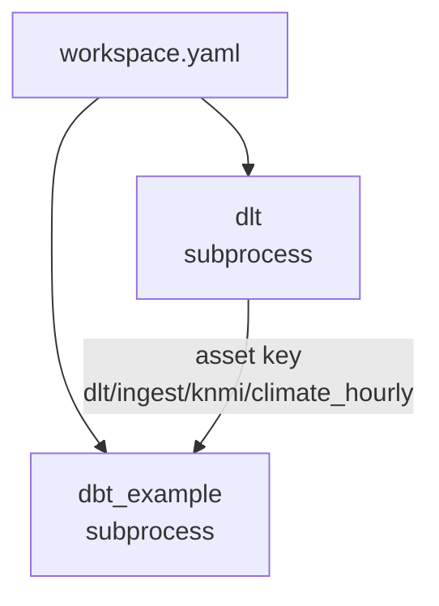

# Orchestration (Dagster)

Dagster is the control plane. Every dlt resource and every dbt model, seed and test is an
asset, organized in code locations that load independently. `just start` runs
`dagster dev -w workspace.yaml` on <http://localhost:3000>; the UI shows one asset graph across
all locations. Dagster reads the same `.env` as everything else, so it runs in whichever
environment the checkout is configured for: your personal schemas in `dev`, the `_<LAYER>`
schemas elsewhere.

## workspace.yaml

`workspace.yaml` at the repository root is the authoritative list of code locations. Each entry
names a Python module of the `orchestrator` package that exposes a top-level `defs`:

```yaml title="workspace.yaml"
load_from:
  - python_module:
      module_name: orchestrator.locations.dlt.definitions
      location_name: "dlt"

  - python_module:
      module_name: orchestrator.locations.dbt.dbt_example.definitions
      location_name: "dbt_example"
```

| Location | Module | Owns |
|----------|--------|------|
| `dlt` | `orchestrator.locations.dlt.definitions` | Every dlt load under `dlt_pipelines/pipelines/ingest/`, plus `job_dlt_ingest_all` |
| `dbt_example` | `orchestrator.locations.dbt.dbt_example.definitions` | The `dbt_example` project as assets, including the `dbt_common` models it builds, plus `job_dbt_example_build_all` |

One location per concern: the ingestion package, and one per dbt project, which is one per
Project of the mesh. The file ends with a commented block for the next dbt project. A genuinely
separate Python concern is one more entry as well.

## Locations load in subprocesses and never import each other

`dagster dev` starts every location in its own subprocess. That gives parallel startup, a
per-location *Reload* button in the UI, and fault isolation: a broken dbt project does not take
the dlt assets down. The flip side is a rule: location modules never import one another.
Nothing in `orchestrator.locations.dlt` knows about `orchestrator.locations.dbt`, and vice
versa. Shared code lives outside the location packages (`orchestrator.resources`,
`orchestrator.locations.dbt.shared`).



## Component trees

Neither location writes assets by hand. Both call `ComponentTree.from_module(...)`, which walks a
Python package, finds every `defs.yaml`, and builds the definitions those components declare.

### The dlt location

```python title="src/orchestrator/locations/dlt/definitions.py"
def _build_defs() -> Definitions:
    loaded = ComponentTree.from_module(defs_module=_dlt_pipelines, project_root=_PROJECT_ROOT).build_defs()
    job_all = define_asset_job(
        name="job_dlt_ingest_all",
        selection=AssetSelection.key_prefixes(["dlt", "ingest"]),
        description="Run every dlt ingest pipeline.",
    )
    return Definitions.merge(loaded, Definitions(jobs=[job_all]))


defs = _build_defs()
```

The module it walks is the whole `dlt_pipelines` package, so
`dlt_pipelines/pipelines/ingest/knmi/defs.yaml` (a `dagster_dlt.DltLoadCollectionComponent`)
is found without registration. Adding a source is adding a folder with a `defs.yaml`. Its
assets join `job_dlt_ingest_all` automatically because the job selects by key prefix. See
[Ingestion](ingestion.md#the-dagster-component).

### The dbt locations

Every dbt location is two small files. `definitions.py` calls the shared factory with the
project name and its `defs` package:

```python title="src/orchestrator/locations/dbt/dbt_example/definitions.py"
from orchestrator.locations.dbt.dbt_example import defs as _defs_module
from orchestrator.locations.dbt.shared import build_dbt_defs

defs = build_dbt_defs("dbt_example", _defs_module)
```

`build_dbt_defs()` in `src/orchestrator/locations/dbt/shared.py` loads the component tree under
`defs/` and adds `job_<project>_build_all` (an `AssetSelection.all()` job). The tree contains
one component:

```yaml title="src/orchestrator/locations/dbt/dbt_example/defs/dbt/defs.yaml"
type: orchestrator.locations.dbt.shared.DataMeshDbtProjectComponent

attributes:
  project:
    project_dir: '{{ context.project_root }}/dbt/dbt_example'
    profiles_dir: '{{ context.project_root }}/dbt'
    prepare_project_cli_args: ["parse", "--quiet"]
  select: "*"
```

`prepare_project_cli_args` makes the location run `dbt parse --quiet` on every load, so the
manifest always matches the SQL on disk. That is also why `dbt deps` must have run first:
without `packages/` the parse fails and the location shows an error. `just dbt-all deps` fixes
it.

## Asset keys

| Kind | Key | Example | Group |
|------|-----|---------|-------|
| dlt resource | `dlt/ingest/<source>/<entity>` (from `defs.yaml`: `key_prefix` + lowercased resource name) | `dlt/ingest/knmi/climate_hourly` | `dlt/ingest/<source>` |
| dbt model, seed | `<project>/<path in the project>/<node name>`; nodes from a package get `<project>/packages/<package>/...` | `dbt_example/models/02_stg/knmi/stg__knmi__climate_hourly`, `dbt_example/packages/dbt_common/seeds/seed_month`, `dbt_example/packages/dbt_common/models/04_mrt/common/dim__common__calendar` | the key without its last segment: `dbt_example/models/02_stg/knmi` |
| dbt source | `config.meta.dagster.asset_key` from the source YAML | `dlt/ingest/knmi/climate_hourly` | the upstream asset's group |

The dbt keys come from `DataMeshDbtTranslator` in `src/orchestrator/locations/dbt/shared.py`:
the project name, the node's path inside the project (`models/02_stg/knmi`), then its name; a
node from an installed package gets `packages/<package>` after the project name. Nothing in
the key depends on the physical schema, so it is the same in every environment: `DBT_INFO_STG`
in `dev` and `_STG` in `prd` both show up under `dbt_example/models/02_stg/...`. The group is
the key without its last segment, so the UI nests assets by project, package, layer and domain.
Search the asset catalog for the model name; when you need the full key in code, it is
`AssetKey(["dbt_example", "models", "02_stg", "knmi", "stg__knmi__climate_hourly"])`.

## Lineage across code locations

The dlt asset and the dbt staging model live in different locations and different processes,
yet the graph shows `dlt/ingest/knmi/climate_hourly` feeding
`dbt_example/models/02_stg/knmi/stg__knmi__climate_hourly`.
No import makes that happen; the key does. The dbt source declares it:

```yaml title="dbt/dbt_example/sources/src_knmi.yml (excerpt)"
sources:
  - name: knmi
    schema: "{{ env_var('SNOWFLAKE_SCHEMA', '') if env_var('ENVIRONMENT', 'dev') in ['dev', 'dummy'] else '' }}_SRC"
    tables:
      - name: climate_hourly
        identifier: knmi__climate_hourly
        config:
          meta:
            dagster:
              asset_key: ["dlt", "ingest", "knmi", "climate_hourly"]
```

Dagster resolves both locations' definitions into one global graph and joins on equal keys.
The same mechanism works in the other direction: a Python asset or a second dbt project that
depends on `dim__common__calendar` names
`AssetKey(["dbt_example", "packages", "dbt_common", "models", "04_mrt", "common", "dim__common__calendar"])`
and gets the edge. Two locations declaring the *same materializable* key is an error; the
project prefix keeps dbt keys apart, so the reason only one dbt project builds the `dbt_common`
models is the tables, which would otherwise be built twice in the same database.

## Jobs

Two convenience jobs exist for the Launchpad; the rest is asset selection in the UI.

| Job | Location | Selection |
|-----|----------|-----------|
| `job_dlt_ingest_all` | `dlt` | Every asset with key prefix `dlt/ingest` |
| `job_dbt_example_build_all` | `dbt_example` | Every asset in the location (`AssetSelection.all()`), which runs `dbt build` for the whole project |

A second dbt project gets `job_<project>_build_all` from the same factory.

## No schedules yet

Nothing fires on its own. There are no schedules and no sensors; you materialize from the UI,
or run `just dlt run knmi` and `just dbt build` from the terminal. Scheduling is the first thing
a deployed environment adds, and it belongs in the location that owns the assets.

## The local instance

`DAGSTER_HOME` is `.dagster/` inside the repository (exported by the justfile and `.envrc`).
Run history and event logs land there, git-ignored; the one versioned file is the instance
config:

```yaml title=".dagster/dagster.yaml"
telemetry:
  enabled: false

run_coordinator:
  module: dagster.core.run_coordinator
  class: DefaultRunCoordinator

run_launcher:
  module: dagster.core.launcher
  class: DefaultRunLauncher

concurrency:
  runs:
    max_concurrent_runs: 4
```

Runs start immediately in a subprocess (no daemon queue), at most four at a time. Deleting
`.dagster/` (keep `dagster.yaml`) resets your run history and nothing else.

`pyproject.toml` also carries a `[tool.dg]` block for Dagster's `dg` CLI. Its `defs_module`
points at the empty `orchestrator.defs` package so the component cache has one home; the real
locations are the ones in `workspace.yaml`.

## Working with it

```bash
just start                                                         # UI on :3000, Ctrl+C stops
just stop                                                          # kill whatever holds port 3000
just validate                                                      # load every location, no UI
just dagster asset list -m orchestrator.locations.dlt.definitions  # any Dagster CLI command
```

`just validate` is the check to run after touching `src/`, `dlt_pipelines/`, `dbt/` or
`workspace.yaml`: it loads every location exactly like `just start` does and fails on import
errors, broken `defs.yaml` files and dbt parse errors. CI runs the same command with
`DBT_TARGET=dummy`.

## Related pages

- [Ingestion](ingestion.md) and [Transformation](transformation.md): what the two locations load
- [Adding Python assets](../development/adding-python-assets.md): merging a plain `@asset` into a location
- [Adding a project](../development/adding-projects.md): the third code location
