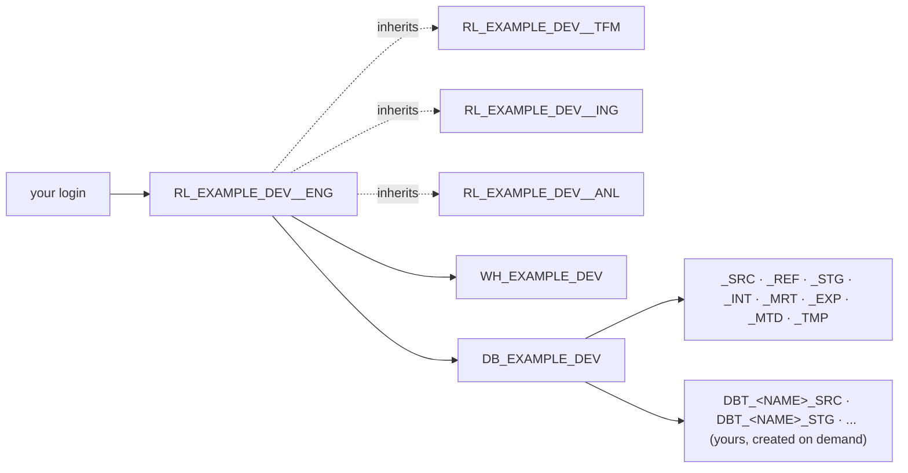
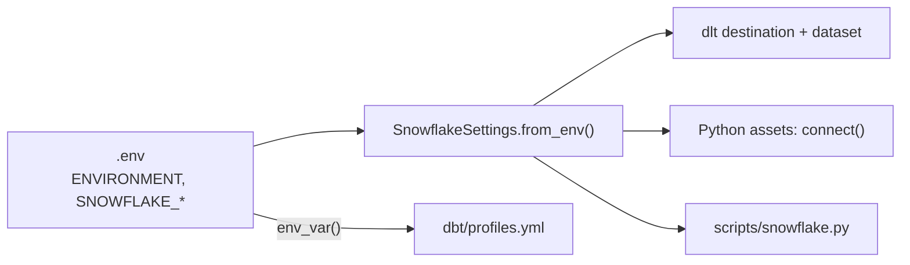

# Snowflake

Snowflake holds the data plane of the platform: one database per Project and Environment,
one schema per Layer, roles with grants per layer, warehouses per compute profile. Terraform
creates all of it from `terraform/config/`. Everything in the repo authenticates with a key pair
and reads its connection settings from one place. This page describes what exists and how the
tools reach it. The administrator's steps are on
[Snowflake provisioning](../administration/snowflake-provisioning.md); this page does not
repeat them.

## What Terraform creates

For every project in `terraform/config/projects/` and each of its environments:

| Concept | Snowflake object | Example project, `dev` |
|---------|------------------|------------------------|
| Project × Environment | database `DB_<PROJECT>_<ENV>`, `PUBLIC` schema dropped | `DB_EXAMPLE_DEV` |
| Layer | schema `_<LAYER>` in that database | `_SRC`, `_REF`, `_STG`, `_INT`, `_MRT`, `_EXP`, `_MTD`, `_TMP` |
| Role | account role `RL_<PROJECT>_<ENV>__<PURPOSE>` with `USAGE` on the database, grants per layer schema (all and future tables, views, ...), grants per warehouse, and inheritance | `RL_EXAMPLE_DEV__ENG`, `RL_EXAMPLE_DEV__ANL`, `RL_EXAMPLE_DEV__ING`, `RL_EXAMPLE_DEV__TFM` |
| Compute | warehouse `WH_<PROJECT>_<ENV>[__<COMPUTE>_<SIZE>]` | `WH_EXAMPLE_DEV` (X-Small, auto-suspend 60 s, created suspended) |
| User | `GRANT ROLE ... TO USER`, and the user itself when `create: true` | `engineer@example.com` gets `RL_EXAMPLE_DEV__ENG` |

The example project has two environments, so the same set exists once more with `PRD`:
`DB_EXAMPLE_PRD`, `RL_EXAMPLE_PRD__*`, `WH_EXAMPLE_PRD`. Nothing is shared between the two.



## Naming

| Object | Pattern | Example |
|--------|---------|---------|
| Database | `DB_<PROJECT>_<ENV>` | `DB_EXAMPLE_DEV`, `DB_EXAMPLE_PRD` |
| Layer schema | `_<LAYER>` | `_SRC`, `_STG`, `_MRT` |
| Personal schema (`dev` only) | `<SNOWFLAKE_SCHEMA>_<LAYER>` | `DBT_INFO_STG` |
| Role | `RL_<PROJECT>_<ENV>__<PURPOSE>` with `ENG`, `ANL`, `ING`, `TFM` | `RL_EXAMPLE_PRD__TFM` |
| Warehouse, default compute | `WH_<PROJECT>_<ENV>` | `WH_EXAMPLE_DEV` |
| Warehouse, other computes | `WH_<PROJECT>_<ENV>__<COMPUTE>_<SIZE>` | `WH_EXAMPLE_PRD__TFM_M` |
| dlt table | `<source>__<entity>` in the source layer | `_SRC.knmi__climate_hourly` |
| dbt model | the model name in its layer schema | `_STG.stg__knmi__climate_hourly` |
| Run metadata | `pre__dbt__<dataset>` in `_MTD` | `_MTD.pre__dbt__model_execution` |
| Provisioning (bootstrap, `init.sql`) | `TERRAFORM_USER`, `RL_PLATFORM_PROVISIONING`, `WH_PLATFORM_PROVISIONING`, `DB_PLATFORM_PROVISIONING`, `RM_PLATFORM_PROVISIONING` | same |

`<PROJECT>`, `<ENV>` and `<PURPOSE>` are the `code` fields of the YAML files, uppercased. The
double underscore separates the scope (`RL_EXAMPLE_DEV`) from the purpose (`ENG`); a single
underscore separates the scope's own parts. Snowflake folds unquoted identifiers to uppercase,
so `_stg` and `_STG` are the same schema.

## Personal schemas in development

Development is shared: everyone who holds `RL_EXAMPLE_DEV__ENG` works in `DB_EXAMPLE_DEV`. The
engineer role has `CREATE SCHEMA` on that database (`privileges.database: dev: [CREATE
SCHEMA]` in `roles/engineer.yaml`, one of the starter's additions), and each engineer sets a
personal prefix in `.env`:

```dotenv
SNOWFLAKE_SCHEMA=DBT_<NAME>
```

`just sf setup` proposes `DBT_` plus the part of your login before the `@`, uppercased
(`DBT_INFO` for `info@example.com`). From then on dlt loads into `DBT_INFO_SRC`, dbt builds
`DBT_INFO_STG`, `DBT_INFO_INT`, ... and the metadata upload writes `DBT_INFO_MTD`, all created on
first use. The provisioned `_<LAYER>` schemas of `DB_EXAMPLE_DEV` stay untouched by local runs.
`tst`, `acc` and `prd` know no personal schemas; there the same code writes to `_<LAYER>`.

The switch is `ENVIRONMENT` in `.env`, read by `SnowflakeSettings.schema_for_layer()`,
`dbt_common.generate_schema_name` and the source YAML. See
[Layers in practice](layers.md#the-schema-naming-rule).

## Key-pair authentication

No passwords in files, no MFA prompt on every run. Every connection from this repo, whether a
person's or a service user's, uses an RSA key pair.

People
:   `just sf setup` (`scripts/snowflake.py`) logs you in once interactively (browser,
    or `--auth password` for password plus MFA), generates an RSA 2048 key pair under
    `~/.snowflake/keys/<account>__<user>.p8` and `.pub`, registers the public key on your own
    user with `ALTER USER ... SET RSA_PUBLIC_KEY`, verifies a key-pair connection, and writes
    the settings to `.env`. `--slot 2` uses `RSA_PUBLIC_KEY_2` for rotation, `--passphrase`
    encrypts the private key. The walkthrough is on
    [Snowflake authentication](../getting-started/snowflake-auth.md).

Service users
:   The ingest and transform roles of a deployed environment are held by service users. An
    administrator creates the user by hand (`CREATE USER <login> TYPE = SERVICE`), generates its
    key pair with `just sf keygen <name>`, which prints the public key body, registers it
    with `ALTER USER <login> SET RSA_PUBLIC_KEY = '...'`, and grants the roles through a
    `create: false` file in `terraform/config/users/`. The Terraform user itself is bootstrapped
    the same way: `just sf keygen terraform`, then the key goes into
    `modules/snowflake/init.sql`.

What ends up in an engineer's `.env`:

```dotenv
ENVIRONMENT=dev
SNOWFLAKE_ACCOUNT=<organization>-<account>
SNOWFLAKE_USER=<your login>
SNOWFLAKE_PRIVATE_KEY_PATH=/absolute/path/to/.snowflake/keys/<account>__<user>.p8
SNOWFLAKE_PRIVATE_KEY_PASSPHRASE=
SNOWFLAKE_ROLE=RL_EXAMPLE_DEV__ENG
SNOWFLAKE_WAREHOUSE=WH_EXAMPLE_DEV
SNOWFLAKE_DATABASE=DB_EXAMPLE_DEV
SNOWFLAKE_SCHEMA=DBT_<NAME>
```

No quotes around values: `just` passes them literally. `*.p8` and `*.pub` files are
git-ignored, and so is `.env`. A deployed environment fills the same variables with the
service user, its key, `RL_<PROJECT>_PRD__TFM` or `__ING`, and `ENVIRONMENT=prd`.

## One settings reader

`SnowflakeSettings` in `src/orchestrator/resources/snowflake.py` is the only code that reads the
`SNOWFLAKE_*` variables and `ENVIRONMENT`. It is a frozen dataclass with one field per
variable; `from_env()` fills it from the environment (blank values keep the field default) and
`missing()` lists the required ones that are not set. From there, each tool gets the shape it
needs:

| Method | Returns | Used by |
|--------|---------|---------|
| `schema_for_layer(layer)` | `_<LAYER>`, or `<SNOWFLAKE_SCHEMA>_<LAYER>` when `is_personal` (`dev`, `dummy`) | dlt's `source_dataset()`, `just sf check` |
| `connection_kwargs()` / `connect()` | Arguments for `snowflake.connector.connect`, with the private key loaded as unencrypted PKCS#8 DER | `scripts/snowflake.py` (`check`, `query`) |
| `dlt_credentials()` | The dict dlt's Snowflake destination expects | `dlt_pipelines/utils/destination.py` |

dbt does not go through Python. `dbt/profiles.yml` reads the same variable names with
`env_var()` for every target, which is why the list above and the profile never disagree.



Every connection identifies itself with the application name `DATA_MESH_STARTER`, and dbt runs
tag their queries with `dbt_invocation_id:<id>`, so the Snowsight query history filters cleanly.

## Checking your connection

```bash
just sf check                                    # who am I, which schemas exist
just sf query "SELECT CURRENT_ROLE(), CURRENT_DATABASE()"
just info                                               # .env and key status without connecting
```

`check` connects with the key pair and prints organization, account, user, role, warehouse,
database, schema and version, then the schemas in your database and the layer schemas your
`ENVIRONMENT` resolves to. If it fails, [Troubleshooting](../getting-started/troubleshooting.md)
lists the usual causes.

## Related pages

- [Snowflake provisioning](../administration/snowflake-provisioning.md): the administrator runbook (bootstrap, configuration, onboarding, teardown)
- [Concepts](../concepts/index.md): the model behind the names
- [Environment variables](../reference/environment-variables.md): every variable `.env` can hold
- [Snowflake authentication](../getting-started/snowflake-auth.md): the one-time setup, step by step
