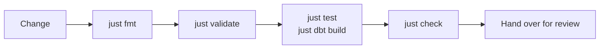

# Build

Four kinds of change cover nearly everything an engineer does here, and a fifth page covers how
you prove any of them works:

- [Adding a dlt load](adding-dlt-loads.md): a second source next to `knmi`, from the pipeline folder through to the dbt staging model that reads it.
- [Adding a dbt model](adding-dbt-models.md): the SQL, its `_conf` YAML, its tests, and which layer it belongs in.
- [Adding a project](adding-projects.md): a new node in the mesh, with its own database, dbt project and Dagster code location.
- [Adding Python assets](adding-python-assets.md): a plain `@asset`, for work that is neither ingestion nor a transformation in Snowflake.
- [Testing](testing.md): pytest, dbt tests, `just validate`, `just check`, the pre-commit hooks and CI.

You work in the development environment of one project: the shared database `DB_<PROJECT>_DEV`,
your own prefixed schemas inside it, the project's engineer role and its warehouse. `just sf setup`
writes all of that into `.env` and there is nothing else to configure. Out of the box the project
is `example`. Background: [Environment](../understand/environment.md), and
[Environment variables](../reference/environment-variables.md) for the schema rule.

## The validation loop

Whatever you changed, it ends the same way.

--8<-- "docs/includes/validation-loop.md"

[Testing](testing.md) has the long version: what each check actually loads, the hooks, and which
CI job runs when.

!!! note "A location that loads is not a pipeline that ran"
    Run the thing before you call it done. For a dlt change, `just dlt run <source>` and then
    count the rows with `just sf query "SELECT COUNT(1) FROM ..."`. For a dbt change,
    `just dbt build --select <model>` and read the summary.
