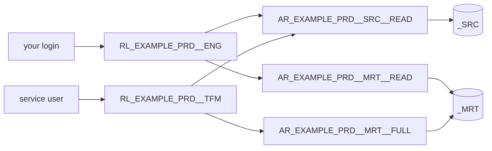

# Access

An Access is a tier of privileges on a [Layer](layer.md): `view`, `read`, `edit` or `full`.
[Roles](role.md) do not list Snowflake privileges themselves; they name one tier per layer and
environment. Terraform turns every layer × tier into an **access role** that holds the
privileges, and the project role inherits the ones it names. This is Snowflake's recommended split
between *functional* roles (what a person or system is) and *access* roles (what may be done
where), and one of the starter's additions to the platform model.

Two things follow from it:

- A privilege is defined once, on the tier (and, for layer-specific objects such as stages,
  once on the layer), never per role. Roles stay short: `source: {dev: full, prd: read}`.
- Every layer in every environment has the same four doors, so "who may write the mart in
  production" is one `SHOW GRANTS OF ROLE AR_EXAMPLE_PRD__MRT__FULL` away.

## The tiers

One file per tier under `terraform/config/accesses/`. The tiers nest: each one holds
everything the tier below it holds.

| Key (file) | `code` | Adds | Meant for |
|------------|--------|------|-----------|
| `view` | `view` | `USAGE` on the schema, `REFERENCES` on tables, views and materialized views | Seeing what exists and how it is defined, without the data |
| `read` | `read` | `SELECT` on tables, views and materialized views, `USAGE` on functions, procedures and sequences | Querying a layer |
| `edit` | `edit` | `INSERT`, `UPDATE`, `DELETE`, `TRUNCATE` on tables | Changing data in objects that already exist |
| `full` | `full` | `CREATE TABLE`, `CREATE VIEW`, `CREATE MATERIALIZED VIEW`, `CREATE SEQUENCE`, `CREATE FUNCTION`, `CREATE PROCEDURE`, `MODIFY` and `MONITOR` on the schema | Owning a layer's contents: what the tooling that builds the layer needs |

```yaml title="terraform/config/accesses/read.yaml"
code: "read"
name: "Read"
desc: "Query the layer: select from tables and views, use functions, procedures and sequences"
sort: 200

privileges:
  - USAGE
  - SELECT ON TABLES
  - REFERENCES ON TABLES
  - SELECT ON VIEWS
  - REFERENCES ON VIEWS
  - SELECT ON MATERIALIZED VIEWS
  - REFERENCES ON MATERIALIZED VIEWS
  - USAGE ON FUNCTIONS
  - USAGE ON PROCEDURES
  - USAGE ON SEQUENCES
```

Object privileges (`X ON TABLES`) apply to all current *and future* objects of that type in
the layer schema. None of the tiers includes `CREATE SCHEMA` or `OWNERSHIP`: a role owns what
it creates, and only Terraform creates schemas.

## Layer extras

A layer can add privileges to a tier under `privileges` in its own file, keyed by tier. The
result is the union of the tier and the extras. Two layers use it:

| Layer | Tier | Extras | Why |
|-------|------|--------|-----|
| `source` | `read`, `edit` | `READ ON STAGES`, `WRITE ON STAGES`, `USAGE ON FILE FORMATS` | dlt loads through the stage `_SRC.ST_DEFAULT`; dbt refreshes its directory table before every run (`ALTER STAGE ... REFRESH`), which Snowflake counts as `WRITE` on the stage. Files can be put and removed, tables stay untouched |
| `source` | `full` | the above plus `CREATE STAGE`, `CREATE FILE FORMAT` | |
| `temporary` | `read`, `edit` | `CREATE TABLE`, `CREATE VIEW` | Scratch space: a role may create its own tables there and owns them, without write on the tables of other roles (dlt's `merge` staging tables, dbt's stored test failures) |

```yaml title="terraform/config/layers/temporary.yaml (the extras)"
privileges:
  read:
    - CREATE TABLE
    - CREATE VIEW
  edit:
    - CREATE TABLE
    - CREATE VIEW
```

## In a role

`privileges.layers` in a role file names one tier per layer, per environment code or `all`
(the environment code wins):

```yaml title="terraform/config/roles/engineer.yaml (abridged)"
privileges:
  layers:
    source: {dev: full, tst: full, prd: read}
    mart: {dev: full, prd: read}
    temporary: {dev: full, tst: full, all: read}
```

The `personal` block of a role names a tier the same way (`access: full`): the role gets that
tier's privileges directly on the personal schemas of every user holding it, since those
schemas are per person and an access role per person would only add roles. See
[Role](role.md#privileges-per-layer-and-environment) for what each shipped role holds.

## In Snowflake

For every project, environment, layer and tier, Terraform creates an account role

```
AR_<PROJECT>_<ENV>__<LAYER>__<ACCESS>      AR_EXAMPLE_PRD__MRT__READ, AR_EXAMPLE_DEV__SRC__FULL
```

with the tier's privileges (plus the layer's extras) on `DB_<PROJECT>_<ENV>._<LAYER>`, and
grants it to the project roles that name it. All four exist for every layer, whether a role
uses them or not: the example project, with two environments and eight layers, gets 64. A
tier nobody names, such as `view`, is a role with privileges and no grantee, ready for a grant
by hand or for a role added later. Changing a role's tier moves one grant; changing a tier's
privileges changes every access role of that tier at once.



`SECURITYADMIN` owns the access roles and every grant, like the project roles. Access roles
are not granted to `SYSADMIN` themselves; they reach it through the project roles that hold
them, which keeps the hierarchy a tree. Warehouse and database privileges stay direct grants on
the project role (`privileges.computes`, `privileges.database`): three warehouse privileges do
not need a tier.

## No secondary roles needed

A project role reaches its access roles through Snowflake's role hierarchy, so a session with
one primary role (`SNOWFLAKE_ROLE` in `.env`, or `USE ROLE RL_EXAMPLE_DEV__ENG`) holds every
privilege of the access roles under it. Secondary roles are a different mechanism: they activate
*all roles granted to the user* in one session, next to the primary role. The hierarchy makes
that unnecessary here, and it would work against the model: with secondary roles on, a person
who holds `RL_EXAMPLE_DEV__ENG` and `RL_EXAMPLE_PRD__ENG` has both in every session, whichever
one they picked.

Since Snowflake's 2024_08 behavior change bundle (BCR-1692) a new user gets
`DEFAULT_SECONDARY_ROLES = ('ALL')`, so that is the default in a current account unless an
administrator sets `ALTER USER <login> SET DEFAULT_SECONDARY_ROLES = ()`. The starter leaves
the account default alone; dbt, dlt and `just sf` always connect with the one role from `.env`.

Next: [Compute](compute.md).
