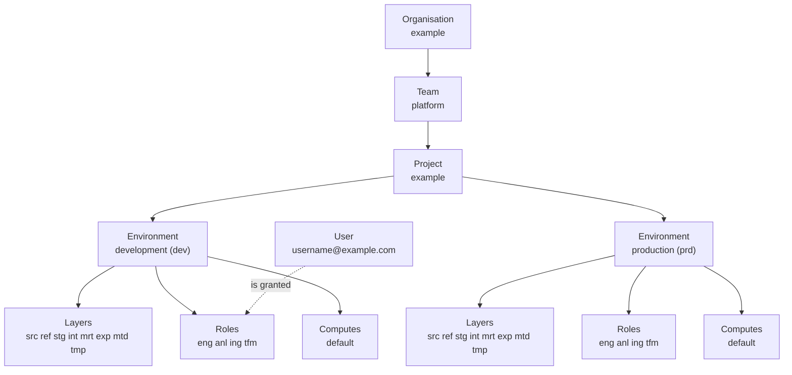

# Concepts

This starter implements the conceptual model of
[rootcube/platform](https://github.com/rootcube/platform): a small set of vendor-agnostic
primitives that say *what* exists in a data mesh platform and *why*, independent of the tools
that implement them. The concepts stay stable. The components (Snowflake, Dagster, dlt, dbt,
Terraform) are the implementation, and they may change without touching the model.

The model is a hierarchy. An **Organisation** has **Teams**. A Team owns **Projects**. A Project
exists in **Environments**. Every Project × Environment has **Layers**, **Roles** and
**Computes**. **Users**, people and services, are granted Project Roles.

The diagram shows the project the starter ships with. Every box is a YAML file under
`terraform/config/`, and `just tf plan` shows what Terraform turns it into.

## Concept by concept

| Concept | Defined in `terraform/config/` | Becomes in Snowflake | Shows up in the repo as |
|---------|-------------------------------|----------------------|-------------------------|
| [Organisation](organisation.md) | `organisations/example.yaml` | The Snowflake account itself; no object is created | `SNOWFLAKE_ACCOUNT` (`<organization>-<account>`) |
| [Team](team.md) | `teams/platform.yaml` | Nothing; ownership metadata that projects point at | `owners` in the YAML |
| [Project](project.md) | `projects/example.yaml` | One database per environment: `DB_EXAMPLE_DEV`, `DB_EXAMPLE_PRD` | `dbt/dbt_example/`, `src/orchestrator/locations/dbt/dbt_example/`, one entry in `workspace.yaml` |
| [Environment](environment.md) | `environments/*.yaml` | The `<ENV>` segment of every database, role and warehouse name | `ENVIRONMENT` in `.env`, which picks the dbt target and the schema naming |
| [Layer](layer.md) | `layers/*.yaml` | A schema `_<LAYER>` in each project database (`_SRC`, `_STG`, `_MRT`, ...) | dbt `+schema` per model folder; the dlt dataset |
| [Role](role.md) | `roles/*.yaml` | An account role `RL_<PROJECT>_<ENV>__<PURPOSE>` with grants per layer and compute | `SNOWFLAKE_ROLE` |
| [Compute](compute.md) | `computes/*.yaml` | A warehouse `WH_<PROJECT>_<ENV>[__<COMPUTE>_<SIZE>]` | `SNOWFLAKE_WAREHOUSE` |
| Users (on the [Role](role.md#users) page) | `users/*.yaml` | Role grants to a login, and optionally the user itself | `SNOWFLAKE_USER` |

Each concept page shows the YAML that defines it, the Snowflake objects it becomes and where
the repo relies on it. [Architecture](../architecture/index.md) covers the same ground from the
tooling side.

## Two personas

Engineer
:   Works in the repository: dlt pipelines, dbt models, Dagster code locations. Authenticates
    with a personal key pair, holds the engineer role of a project, and in development works
    in personal schemas of the shared development database. Never needs Terraform.

Platform administrator
:   Owns `terraform/`. Bootstraps the account once, edits the YAML under `terraform/config/`,
    runs `just tf plan` and `just tf apply`, and onboards people and service users. The
    runbook is [Snowflake provisioning](../administration/snowflake-provisioning.md).

## What is deliberately not a concept

The platform model keeps its concepts few and fundamental. Four familiar words are left out on
purpose, and this repo follows that:

Domain
:   A business construct that changes over time. Domain alignment is expressed through Teams
    and Projects. In this repo a domain is only a naming segment: the `<domain>` in
    `int__<domain>__<entity>` and the folder under `models/<layer>/<domain>/`.

Pipeline, workflow
:   Implementation artefacts of the orchestration component. A dlt pipeline or a Dagster job
    is transient and carries no ownership. They live inside a Project, not next to it.

Data product
:   A derived idea, not a primitive. A data product is whatever a Project exposes through its
    expose layer (`_EXP`), with the owning Team accountable for the contract.

Asset, dataset, table, view
:   Physical artefacts produced by components. They exist *within* Layers, Projects and
    Environments and are governed through Roles. A dlt table in `_SRC` or a dbt model in
    `_MRT` needs no concept of its own.

## The rules, in short

The platform states its rules as numbered invariants. These are the ones the starter enforces
or relies on, with the place they bite.

| Rule | Where it shows up here |
|------|------------------------|
| A Project has exactly one owning Team | `team:` in `projects/example.yaml`; the validator rejects an unknown team |
| Environments are lifecycle boundaries: no implicit sharing of data, compute or credentials | A database, a warehouse and a set of roles per environment; a key pair per user |
| Layers are semantic conventions, not security boundaries | Access comes from role grants per layer, not from the schema itself |
| Roles are scoped to Project × Environment | `RL_EXAMPLE_DEV__ENG` is a different role from `RL_EXAMPLE_PRD__ENG` |
| Compute is isolated per Project × Environment | `WH_EXAMPLE_DEV` and `WH_EXAMPLE_PRD` are separate warehouses |
| Cross-project consumption happens via the expose layer only | A second project reads another project's `_EXP` as a dbt source; nothing else |
| Human access to production is read-only by default | `roles/engineer.yaml` grants `SELECT` only in `prd`; writes belong to the transform and ingest system roles |
| Changes are promoted forward, dev to prd | `ENVIRONMENT` selects the target; the same code runs in every environment |
| A model references only the layer directly below it | The dbt layer rule, checked in review (see [Layers in practice](../architecture/layers.md)) |
| One dbt project and one Dagster code location per Project | `dbt/dbt_<project>/` plus `src/orchestrator/locations/dbt/dbt_<project>/` |
| Exactly one project builds the `dbt_common` models | Duplicate asset keys across code locations are an error in Dagster |

## Three additions to the platform model

`terraform/README.md` lists what this starter adds on top of rootcube/platform, kept small so
they can flow back upstream:

1. `config/users/` and `users.tf`: role grants to logins, and optional user creation.
2. `privileges.database` on a role: extra database privileges per environment on top of the
   implicit `USAGE`. Engineers get `CREATE SCHEMA` in `dev` for their personal schemas.
3. `config/layers/metadata.yaml` (`_MTD`): the layer where dbt writes run metadata.

The platform repository's other providers are not part of the starter. The provider is
Snowflake only.

## Where to go next

- [Architecture](../architecture/index.md): how Terraform, dbt, dlt and Dagster implement the concepts
- [Snowflake provisioning](../administration/snowflake-provisioning.md): the administrator runbook
- [Naming](../conventions/naming.md): every name pattern in one place
