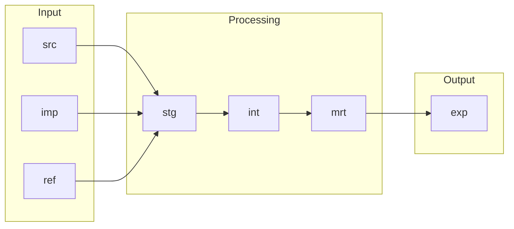

# Layer

Layers give the data inside a Project × Environment a logical and semantic structure. They say
what a dataset is for, how mature it is and who may rely on it. They do **not** represent
ownership or lifecycle boundaries, and they are not security boundaries on their own: access is
granted per layer through [Roles](role.md).

Layers are a convention. A Project picks the layers it needs, and the chosen set applies to
every Environment of that Project.

## The layers

One file per layer under `terraform/config/layers/`. The `code` becomes the schema name.

| Key (file) | `code` | Type | Purpose | `required` | `disabled` | Used by `example` |
|------------|--------|------|---------|------------|------------|-------------------|
| `source` | `src` | input | Actively collected raw data from source systems | yes | no | yes |
| `import` | `imp` | input | Received data contracts from other Projects' expose outputs | no | no | no |
| `reference` | `ref` | input | Curated reference and lookup datasets used across models | no | no | yes |
| `preparation` | `prp` | processing | Initial cleansing and harmonisation of raw inputs | no | no | no |
| `staging` | `stg` | processing | Mandatory landing layer for standardising and cleaning inputs | yes | no | yes |
| `integration` | `int` | processing | Reconciled and integrated entities, the business layer | no | no | yes |
| `mart` | `mrt` | processing | Analytics-ready models optimised for specific use cases | no | no | yes |
| `expose` | `exp` | output | Published outputs and cross-project contracts | yes | no | yes |
| `application` | `app` | output | Application-owned datasets that support products and apps | no | yes | no |
| `metadata` | `mtd` | operational | Run metadata written by the tooling (dbt run results, freshness) | no | no | yes |
| `temporary` | `tmp` | operational | Short-lived datasets for operations and intermediate work | no | no | yes |

```yaml title="terraform/config/layers/staging.yaml"
code: "stg"
name: "Staging Layer"
desc: "Mandatory landing layer for standardising and cleaning inputs"
type: "processing"
sort: 220
disabled: false
required: true
```

The `type` groups layers by how data moves through a Project:

input
:   Data enters the Project boundary. `src` is what the Project collects itself, `imp` is
    what it passively receives from another Project's `exp`, `ref` is curated lookup data.

processing
:   Data is cleaned, integrated and modelled: `prp`, `stg`, `int`, `mrt`.

output
:   Data leaves the Project as a contract: `exp` for other Projects and downstream systems,
    `app` for applications that need read and write access.

operational
:   Bookkeeping that is not a modelling step: `mtd` for run metadata, `tmp` for short-lived
    work that nothing may depend on.

`metadata` is one of the starter's additions to the platform model. `application` ships
disabled: a project that lists it gets a validator warning and no schema until an
administrator flips the flag.

## How data flows



Cross-project sharing always runs from one Project's `exp` into another Project's `imp`. A
Project must never read another Project's non-expose layers.

## Layer by layer

`src`, Source
:   Raw data as the source system returned it, no business logic, not for direct
    consumption. Here: the tables dlt loads, `<source>__<entity>` such as
    `knmi__climate_hourly`.

`imp`, Import
:   Data products received from other Projects, read-only, reshaped downstream. Distinct from
    `src` so that cross-project dependencies stay explicit. Not used by the example project.

`ref`, Reference
:   Small, stable, curated datasets: code lists, calendars, mappings. Here: dbt seeds.

`prp`, Preparation
:   An optional cleansing step before staging. Enabled, but not used by the example project.

`stg`, Staging
:   The first transformed layer: typing, renaming, deduplication, unit conversion, one model
    per source table, no joins. Here: `stg__knmi__climate_hourly`.

`int`, Integration
:   Reusable, joined and enriched datasets that are not yet facts or dimensions. Organised by
    domain, not by source. Here: the common calendar chain from `dbt_common` and the `weather`
    models of `dbt_example`.

`mrt`, Mart
:   Modelled, analytics-ready data: dimensions, facts, bridges, aggregates. Here:
    `dim__common__calendar`, `dim__common__time`, `dim__common__environment`, and the weather star
    `dim__weather__station`, `dim__weather__measurement_type`, `fct__weather__observation`.

`exp`, Expose
:   The publication boundary. Whatever is here is a contract; the owning Team keeps it
    backward compatible. Here: `exp__weather__station_weather`, read by the `weather_dashboard`
    exposure.

`app`, Application
:   Operational datasets for applications with CRUD access, separate from the analytical
    path. Disabled in the starter.

`mtd`, Metadata
:   Run metadata written by the tooling. Here: the `pre__dbt__*` tables that `dbt_common`
    fills after every dbt run.

`tmp`, Temporary
:   Ephemeral datasets with no guarantees and no dependants. Here: stored dbt test failures,
    plus whatever an analyst or engineer creates and drops.

## In Snowflake

Every layer a project lists becomes one schema per project database, named `_<LAYER>` with
the code uppercased: `DB_EXAMPLE_DEV._SRC`, `DB_EXAMPLE_DEV._STG`, ... ,
`DB_EXAMPLE_PRD._TMP`. The leading underscore marks a provisioned layer schema.

In `dev`, engineers work in personal copies of the same layers, `<SNOWFLAKE_SCHEMA>_<LAYER>`
(`DBT_USERNAME_SRC`, `DBT_USERNAME_STG`, ...), created on demand by dlt and dbt. The mapping is in
`SnowflakeSettings.schema_for_layer()` and `dbt_common.generate_schema_name`; see
[Environment](environment.md#development-is-special).

Roles get their privileges per layer and per environment (`privileges.layers` in
`roles/*.yaml`), applied to the `_<LAYER>` schemas and to all current and future tables and
views in them. A layer with no grant for a role is invisible to that role.

## In the repo

| Layer | Written by | Where |
|-------|-----------|-------|
| `src` | dlt | `dlt_pipelines/pipelines/ingest/<source>/`, dataset from `source_dataset()` |
| `ref` | `dbt seed` | `seeds/` with `+schema: ref` |
| `stg`, `int`, `mrt`, `exp` | dbt models | `models/02_stg`, `03_int`, `04_mrt`, `05_exp` with `+schema: stg`, `int`, `mrt`, `exp` |
| `mtd` | `dbt_common` `on-run-end` hook | `macros/dbt_artifacts/`, tables created on first use |
| `tmp` | dbt data tests | `data_tests: +store_failures: true`, `+schema: tmp` |

What belongs in each layer, the materializations and the reference-only-the-layer-below rule
are on [Layers in practice](../architecture/layers.md).

Next: [Role](role.md).
