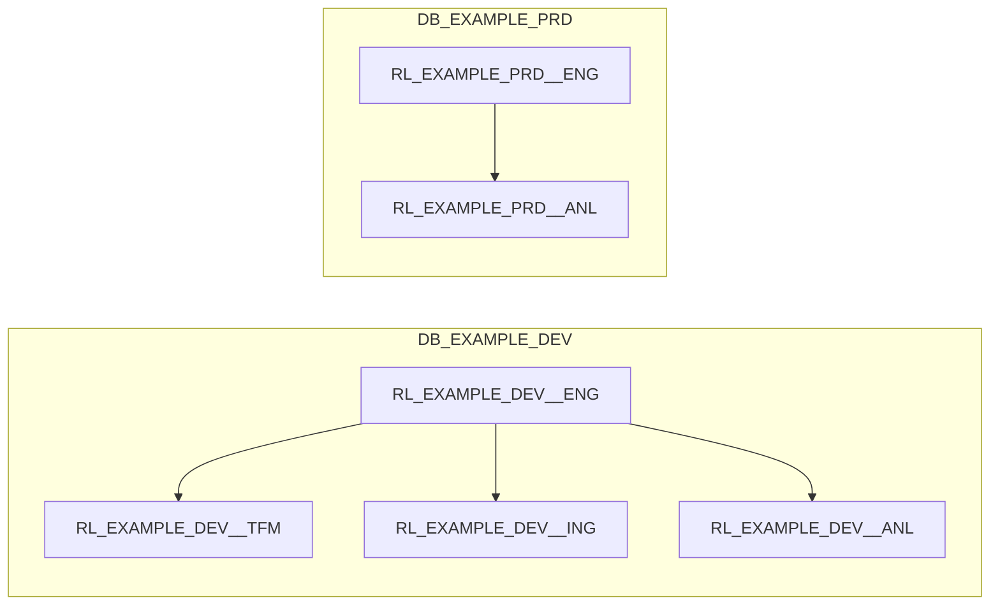

# Role

A Role defines who or what may perform which actions. Roles are the mechanism for
least-privilege access and separation of duties. A Role grants capabilities; [Layers](layer.md)
define semantics. Access to a layer is a grant on a role, never a property of the layer.

Principles from the platform model, all of which the starter keeps:

- A Role is scoped to **Project × Environment**. `RL_EXAMPLE_DEV__ENG` and
  `RL_EXAMPLE_PRD__ENG` are two roles with different grants.
- A Role is assumed by either a **person** or a **system**; a **hybrid** role may be assumed
  by both, never concurrently.
- A Role grants the minimum privileges for its responsibility.
- Human access to production is read-only by default.
- Inheritance is shallow and explicit.

## Two axes

Level
:   `platform` roles span the whole Organisation; `project` roles are created per Project ×
    Environment. Terraform only instantiates project roles. The three platform-level
    definitions under `roles/global/` (administrator, monitoring, provisioning) are `disabled`
    placeholders; provisioning itself runs as `RL_PLATFORM_PROVISIONING`, created once by
    `terraform/modules/snowflake/init.sql`.

Type
:   `person` for humans, `system` for pipelines and services, `hybrid` for both.

## The project roles

One file per role under `terraform/config/roles/`. The example project lists four; two more
ship with the starter.

| Key (file) | `code` | Type | Purpose | `required` | In `example` |
|------------|--------|------|---------|------------|--------------|
| `engineer` | `eng` | person | Develops and maintains ingestion and transformation pipelines | yes | yes |
| `analyst` | `anl` | person | Read-focused exploration and consumption | no | yes |
| `ingest` | `ing` | system | Ingestion tooling (dlt) loading the source layer | yes | yes |
| `transform` | `tfm` | system | Transformation tooling (dbt) reading and writing across layers | yes | yes |
| `reporting` | `rpt` | hybrid | Reporting systems reading curated data | no | no |
| `operator` | `opr` | person | Elevated project-level operational access (`disabled`) | no | no |

```yaml title="terraform/config/roles/ingest.yaml (abridged)"
code: "ing"
name: "Ingest"
type: "system"
level: "project"
desc: "Used by ingestion tooling (e.g. dlt) to load data into the SRC layer"
disabled: false
required: true

privileges:
  computes:
    ingest:
      all: [USAGE, OPERATE]
  layers:
    source:
      all:
        - USAGE
        - MODIFY
        - CREATE TABLE
        - CREATE VIEW
        - CREATE STAGE
        - CREATE FILE FORMAT
        # ...
        - SELECT ON TABLES
        - INSERT ON TABLES
        # ...
```

The `privileges` block has four parts, each keyed by environment code or `all`:

| Key | Grants on | Note |
|-----|-----------|------|
| `database` | The project database | `USAGE` is implicit for every role with layer privileges; this adds more per environment (a starter addition) |
| `computes` | The warehouse of a compute profile | Only for profiles the project lists |
| `layers` | The `_<LAYER>` schema and its current and future tables, views, functions, ... | Only for layers the project lists; `X ON TABLES` becomes an all-plus-future grant |
| `roles` | Another project role, in the listed environments | The role **inherits** that role's privileges |

## Privileges per layer and environment

What each of the four roles may do, as defined in the YAML. "write" stands for `USAGE`,
`MODIFY`, `CREATE TABLE`, `CREATE VIEW`, `SELECT`, `INSERT`, `UPDATE`, `DELETE` and `TRUNCATE ON
TABLES` and `SELECT ON VIEWS`; "read" for `USAGE`, `SELECT ON TABLES` and `SELECT ON VIEWS`.

=== "engineer (ENG)"

    | Layer | `dev` | `tst` | `prd` |
    |-------|-------|-------|-------|
    | `source` | write | write | read |
    | `staging`, `integration`, `mart`, `expose`, `reference` | write | none | read |
    | `metadata` | write (tables only) | none | `USAGE`, `SELECT ON TABLES` |
    | `temporary` | write | write | write |

    Database: `CREATE SCHEMA` in `dev`, for the personal schemas. Computes: `USAGE`,
    `OPERATE`, `MONITOR` on `default`, `ingest` and `transform`. Inherits `transform` and
    `ingest` in `dev` and `tst`, and `analyst` everywhere. There is no `acc` block, so an
    engineer in acceptance would only see the temporary layer.

=== "analyst (ANL)"

    | Layer | all environments |
    |-------|------------------|
    | `mart`, `expose` | read, plus `USAGE ON FUNCTIONS` and `USAGE ON PROCEDURES` |
    | `temporary` | write |

    Computes: `USAGE` on `default`.

=== "ingest (ING)"

    | Layer | all environments |
    |-------|------------------|
    | `source` | write, plus `CREATE STAGE`, `CREATE FILE FORMAT`, `CREATE FUNCTION`, `CREATE PROCEDURE` and usage of those objects |

    Computes: `USAGE`, `OPERATE` on `ingest`.

=== "transform (TFM)"

    | Layer | all environments |
    |-------|------------------|
    | `source` | read, plus usage of functions, procedures, stages and file formats |
    | `staging`, `integration`, `mart`, `expose` | write, plus `CREATE MATERIALIZED VIEW`, `CREATE FUNCTION`, `CREATE PROCEDURE` |
    | `reference`, `temporary` | write |
    | `metadata` | write (tables only) |

    Computes: `USAGE`, `OPERATE` on `transform`.

This is the production-safety rule in concrete form: in `prd` the person role reads, the two
system roles write.

!!! note "System roles and warehouses"
    `ingest` and `transform` ask for the `default` compute plus their own `ingest` and
    `transform` profiles. Warehouse grants are created only for profiles a project lists, so
    with `projects/example.yaml` (`default` only) `RL_EXAMPLE_<ENV>__ING` and
    `RL_EXAMPLE_<ENV>__TFM` run on `WH_EXAMPLE_<ENV>`; list the extra profiles to give them
    dedicated warehouses. See [Compute](compute.md).

## Inheritance

`privileges.roles` on a role names the roles it inherits, per environment. For the example
project (environments `development` and `production`) that yields:



An arrow means "inherits". In development an engineer can do everything the system roles can,
which is what local development needs. In production an engineer inherits only the analyst.
`test` is listed for the system roles too, but the example project has no test environment.

## Users

Users are the starter's first addition to the platform model. One file per person or service
under `terraform/config/users/` says which project roles a login may assume:

```yaml title="terraform/config/users/<name>.yaml"
login: "engineer@example.com"
name: "Example Engineer"
type: "person"
create: false
roles:
  - project: example
    role: engineer
    environments:
      - development
```

`terraform/users.tf` turns every entry into a `GRANT ROLE ... TO USER`. `environments` may be
`"*"` for every environment of the project. `create: false` means the login already exists
(SSO); `create: true` creates it, with a one-time password for a `person`
(`just tf output -json initial_passwords`) or without a password for a `service`, whose key
pair is registered afterwards with `ALTER USER <login> SET RSA_PUBLIC_KEY = '...'`.

Which role a tool runs as is not decided in Terraform but in `.env`:

| Who | `SNOWFLAKE_ROLE` | How |
|-----|------------------|-----|
| An engineer in `dev` | `RL_<PROJECT>_DEV__ENG` | Written by `just snowflake setup` |
| dbt in a deployed environment | `RL_<PROJECT>_<ENV>__TFM` | A `service` user in `users/` with that role |
| dlt in a deployed environment | `RL_<PROJECT>_<ENV>__ING` | Same |

## In Snowflake

Every project role becomes an account role `RL_<PROJECT>_<ENV>__<PURPOSE>` (the `code`
uppercased) with a database grant, one grant set per listed layer, one per listed compute and
the inheritance grants above. A platform role would be named `RL_PLATFORM__<PURPOSE>`; none is
created by the starter.

Next: [Compute](compute.md).
