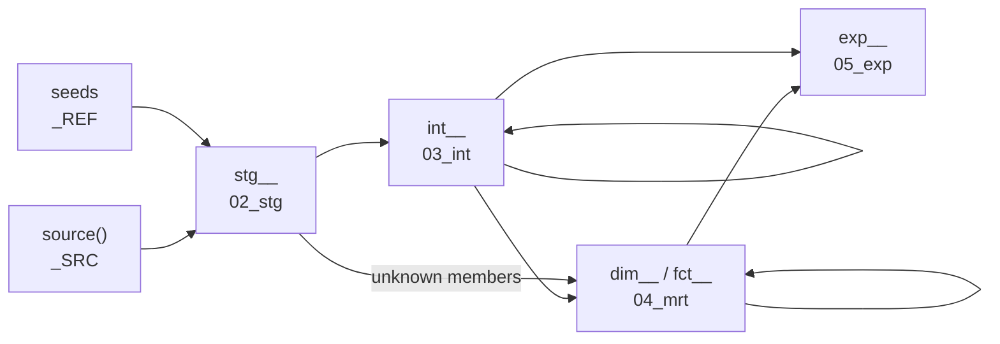

# dbt style guide

How dbt models are designed, placed, configured, tested and documented. Some principles derive
from the [dbt Labs style guide](https://docs.getdbt.com/best-practices/how-we-style/0-how-we-style-our-dbt-projects);
quite a few are customized.

Two related pages carry the rules this page does not repeat:

- [SQL style](sql-style.md): sqlfluff formatting and syntax (leading commas, casing, `CAST()` not
  `::`, CTE and Jinja style)
- [Naming](naming.md): model, column, test and tag naming per layer

!!! info "Which project?"
    A model belongs to the project that owns its data. The starter ships one, **`dbt_example`**
    (`dbt/dbt_example/`). **`dbt_common`** (`dbt/dbt_common/`) is the shared package every
    project installs: macros, the common calendar/time/environment dimensions and the reference
    seeds. It is not a place for domain models. A new node in the mesh gets its own project next
    to `dbt_example`, see [Adding a project](../development/adding-projects.md). Project layout:
    [Transformation](../architecture/transformation.md).

## Layers

Data flows through the layer schemas of the project database, `DB_<PROJECT>_<ENV>`. Each dbt
layer has its own folder, schema, purpose and default materialization (from
`dbt/dbt_example/dbt_project.yml`):

| Layer | Folder | Schema | Materialized | Purpose |
|---|---|---|---|---|
| Source | (dlt, not dbt) | `_SRC` | table | Data landed 1:1 by dlt as `<source>__<entity>`, e.g. `knmi__climate_hourly` |
| Reference | `seeds/` | `_REF` | seed | Static reference data (CSV) |
| Staging | `models/02_stg` | `_STG` | table | Typed, renamed, unit-converted source data |
| Integration | `models/03_int` | `_INT` | table | Business logic, joins, enrichment |
| Mart | `models/04_mrt` | `_MRT` | table | Dimensional model (dimensions, facts) |
| Expose | `models/05_exp` | `_EXP` | view | Published outputs: the project's contract with consumers and other projects |

Two more schemas are dbt's own: test failures are stored in `_TMP` (`+store_failures: true`,
`+schema: tmp`), and the `dbt_common` `on-run-end` hook uploads run metadata (models, tests,
executions) into `pre__dbt__*` tables in `_MTD`.

The schema names above are the provisioned ones in `tst`, `acc` and `prd`. In `dev` every
engineer works in personal copies prefixed with `SNOWFLAKE_SCHEMA`: `DBT_USERNAME_STG`,
`DBT_USERNAME_MRT`, and so on, all in the shared `DB_<PROJECT>_DEV`. `dbt_common` overrides
`generate_schema_name` to implement that rule; a model without a `+schema` config lands in
`SNOWFLAKE_SCHEMA` itself (`DBT` by profile default, `_TMP` in the shared environments).

| target | `target.schema` | `+schema` | Result |
|---|---|---|---|
| dev | `DBT_USERNAME` | `stg` | `DBT_USERNAME_STG` |
| dev | `DBT_USERNAME` | (none) | `DBT_USERNAME` |
| prd | `_TMP` | `stg` | `_STG` |
| prd | `_TMP` | (none) | `_TMP` |

## Layer reference rules

Models reference only the layer directly below. No skipping, no reaching up:



| Layer | Allowed references |
|---|---|
| STG | `source()` only, or the seed `ref()` for `stg__seed__*` models |
| INT | `stg__` and other `int__` models |
| MRT | `int__` models, `dim__` models (for fact foreign keys), `fct__` models (for aggregate roll-ups), and `stg__seed__unknown` (the unknown member a dimension unions in) |
| EXP | `int__` and mart (`dim__`/`fct__`/`brg__`/`agg__`) models |

!!! danger "Enforced in review"
    "STG cannot ref INT, MRT cannot ref EXP" is one of the explicit pitfalls in `AGENTS.md`. Use
    `{{ ref('model_name') }}` for models and `{{ source('source', 'table') }}` for source
    tables, nothing else. Nothing checks this automatically; reviewers do.

## Every model needs

1. A **`config()` block** at the top with `materialized` (when it differs from the folder default)
   and the model's `unique_key`.
2. A **YAML file in `_conf/`**, one per model, named identically to the SQL file, starting with
   `version: 2`, with a `description` and a `data_type` for every column.
3. **Named tests on the key**: `unique` + `not_null`, or `dbt_utils.unique_combination_of_columns`
   for a composite key, plus `dbt_common.has_data` on the model.
4. **Explicit column selection** (no `SELECT *` out of the model), **every table named with `AS`
   and every column qualified**, and **explicit type casts** (`CAST(...)`, applied in staging).
5. **Filters applied as early as possible**, to reduce the data processed downstream.
6. dlt's bookkeeping column `_dlt_load_id` carried forward from staging **only when a downstream
   model needs it**.

The layer tag (`layer=stg` and so on) is added per folder by `dbt_project.yml`; you do not set
it. Extra `key=value` tags are optional metadata, the way the `dbt_common` models carry `owner=`,
`system=` and `category=`.

```sql title="dbt/dbt_example/models/02_stg/knmi/stg__knmi__climate_hourly.sql (config block)"
{{
    config(
        materialized='table',
        unique_key=['station_code', 'observed_at']
    )
}}
```

## File placement

```text
dbt/dbt_example/
├── models/<layer>/<domain>/
│   ├── _conf/                   # YAML, one file per model
│   │   └── <model_name>.yml
│   └── <model_name>.sql
├── sources/src_<source>.yml     # one file per source system
├── seeds/                       # CSV files + _conf/seed_<name>.yml
├── macros/                      # project-specific macros
└── tests/                       # singular and custom generic tests
```

`<domain>` is the source system in staging (`02_stg/knmi/`) and the business domain from
integration up (`03_int/common/` in `dbt_common`).

!!! warning "YAML never sits next to SQL"
    Always in `_conf/`. Sources live in `sources/`, never inside model folders.

## Layer design

### STG (`02_stg`)

Organized by source system. One source table in, business-friendly names, explicit `CAST`s and
unit conversions out. A single `SELECT` from one `source()` (or, for seeds, one `ref()`), no
joins. Materialized as `table` because downstream models read these often.

Record-level derivations from the row's own fields belong here (the KNMI hour-ending timestamp,
the `-1` precipitation sentinel). Anything that needs another row or another table does not.

```sql title="dbt/dbt_example/models/02_stg/knmi/stg__knmi__climate_hourly.sql"
{{
    config(
        materialized='table',
        unique_key=['station_code', 'observed_at']
    )
}}

-- KNMI hourly observations, typed and converted to SI-ish units. The API's hour 1..24 is the
-- hour *ending* at that time, so hour 24 of 2024-01-01 becomes 2024-01-02 00:00.
WITH cte_source AS (

  SELECT
    src.station_code
  , src.date
  , src.hour
  , src.t
  , src.fh
  , src.rh
  , src.q
  , src.u
  , src._dlt_load_id
  FROM
    {{ source('knmi', 'climate_hourly') }} AS src

)

SELECT
  CAST(obs.station_code AS INTEGER)                                                         AS station_code
, DATEADD('hour', CAST(obs.hour AS INTEGER), CAST(CAST(obs.date AS DATE) AS TIMESTAMP_NTZ)) AS observed_at
, CAST(obs.t AS INTEGER) / 10.0                                                             AS temperature_celsius
, CAST(obs.fh AS INTEGER) / 10.0                                                            AS wind_speed_ms
, CASE
    WHEN CAST(obs.rh AS INTEGER) = -1 THEN 0.05
    ELSE CAST(obs.rh AS INTEGER) / 10.0
  END                                                                                       AS precipitation_mm
, CAST(obs.q AS INTEGER)                                                                    AS global_radiation_jcm2
, CAST(obs.u AS INTEGER)                                                                    AS relative_humidity_pct
, obs._dlt_load_id
FROM
  cte_source AS obs
```

Seeds get the same treatment in `stg__seed__<name>` models (the shared ones live in
`dbt/dbt_common/models/02_stg/seed/`):

```sql title="dbt/dbt_common/models/02_stg/seed/stg__seed__month.sql"
SELECT
  CAST(src.month_nr AS INTEGER)       AS month_nr
, CAST(src.month_code AS VARCHAR(3))  AS month_code
, CAST(src.month_name AS VARCHAR(20)) AS month_name
FROM
  {{ ref('seed_month') }} AS src
```

### INT (`03_int`)

Organized by business domain (`common/` in `dbt_common` is the example). This is where business
logic lives: joining staging models, deriving attributes, enriching. CTEs do the work, one logical
step each. Default materialization in `dbt_example` is `table`; `dbt_common` builds its
intermediate models as views. `cluster_by` and `unique_key` go in the config when it helps.

```sql title="Intermediate template"
{{
    config(
        unique_key=['<key_column>']
    )
}}

WITH cte_<descriptive_name> AS (
  SELECT
    src.<column_1>
  , src.<column_2>
  FROM
    {{ ref('stg__<source>__<entity>') }} AS src
)

, cte_<next_step> AS (
  SELECT
    stp.<column_1>
  , stp.<column_2>
  , <transformation> AS <derived_column>
  FROM
    cte_<descriptive_name> AS stp
)

SELECT
  nxt.<column_1>
, nxt.<column_2>
, nxt.<derived_column>
FROM
  cte_<next_step> AS nxt
```

From this layer up, each concept has exactly one model. Do not create source-suffixed twins of
the same entity; integrate the sources in one model instead.

### MRT (`04_mrt`)

The dimensional model: dimensions (`dim__`), facts (`fct__`), bridges (`brg__`) and aggregates
(`agg__`), organized by business domain. Materialized as `table`.

**Dimensions** carry a surrogate key named `id_dim__<domain>__<entity>` and union in the unknown
member from `stg__seed__unknown`, so a fact whose lookup misses can still point at a row. The key
can be a natural integer (`date_simple` in `dim__common__calendar`), a hash of the business key
(`SHA1(environment_code)` in `dim__common__environment`) or
`{{ dbt_utils.generate_surrogate_key([...]) }}`.

```sql title="dbt/dbt_common/models/04_mrt/common/dim__common__environment.sql"
{{
    config(
        enabled=true,
        tags=['owner=public', 'system=common', 'category=environment']
    )
}}

SELECT
  SHA1(environment_code) AS id_dim__common__environment

, environment_code
, environment_name
, environment_alias
, environment_desc
, environment_sort

FROM
  {{ ref('int__common__environment') }}

UNION ALL

SELECT
  CAST(unknown_id AS VARCHAR) AS id_dim__common__environment

-- Attributes
, unknown_code                AS environment_code
, unknown_name                AS environment_name
, unknown_name                AS environment_alias
, ''                          AS environment_desc
, -1                          AS environment_sort
FROM
  {{ ref('stg__seed__unknown') }}
```

**Facts** carry the fact surrogate key, foreign keys to dimension surrogate keys, event
timestamps, indicators, and clearly separated measures. Nothing else: an attribute a dimension
holds is reached through its foreign key, never repeated on the fact.

```sql title="Fact template"
SELECT
  {{ dbt_utils.generate_surrogate_key(['src.<fact_key>']) }}      AS id_fct__<domain>__<entity>
, COALESCE(<dim_name>.id_dim__<domain>__<dim_entity>, '-2')      AS id_dim__<domain>__<dim_entity>

-- Measures
, CAST(src.<measure_expression> AS <data_type>)                  AS <measure_name>
FROM
  {{ ref('int__<domain>__<entity>') }} AS src

  LEFT JOIN {{ ref('dim__<domain>__<dim_entity>') }} AS <dim_name>
    ON <dim_name>.<business_key> = src.<business_key>
```

`-2` is the "unknown" row of `seed_unknown` (`-1` empty, `-2` unknown, `-3` not applicable), the
same rows the dimension unions in above.

### EXP (`05_exp`)

Published models tailored to one consumer or one contract with another project, organized by
business domain. Projections, filters, `COALESCE` logic, and the joins that put a star back
together into the flat shape a consumer wants, plus a SQL comment naming the data product and
its consumer. Materialized as `view`, so always up to date. In the mesh, `_EXP` is the only
layer another project is meant to read.

What does *not* belong here is new truth: derivations, window functions and business rules that
compute something the layers below cannot express. That logic goes to INT or MRT.

```sql title="Expose template"
{{
    config(
        unique_key=['<unique_key>']
    )
}}

/*
  Data product: <product_name>
  Purpose: <what this model provides and to whom>
*/

SELECT
  mrt.<column_1>
, mrt.<column_2>
, COALESCE(mrt.<column_a>, mrt.<column_b>) AS <unified_column>
FROM
  {{ ref('<mart_model>') }} AS mrt
WHERE <filter_condition>
```

## Model configuration (YAML)

1. One file per model in the `_conf/` folder next to the SQL: `_conf/<model_name>.yml`.
2. `version: 2` at the top.
3. A `description` on the model and on every column, and a `data_type` per column.
4. No top-level `meta` on a model: dbt deprecates it and warns on every parse. Ownership is a tag,
   if anything.
5. Every test named, following the conventions in [Tests](#tests); generic tests take their
   parameters under `arguments:`.

```yaml title="dbt/dbt_example/models/02_stg/knmi/_conf/stg__knmi__climate_hourly.yml (condensed)"
version: 2

models:
  - name: stg__knmi__climate_hourly
    description: Typed KNMI hourly observations, one row per station per hour.

    data_tests:
      - dbt_common.has_data:
          name: stg__knmi__climate_hourly__has_data

      - dbt_utils.unique_combination_of_columns:
          name: stg__knmi__climate_hourly__station_code__observed_at__unique
          arguments:
            combination_of_columns: [station_code, observed_at]

    columns:
      - name: station_code
        description: KNMI station number.
        data_type: integer
        data_tests:
          - not_null:
              name: stg__knmi__climate_hourly__station_code__not_null

      - name: precipitation_mm
        description: Hourly precipitation in mm.
        data_type: number
        data_tests:
          - dbt_common.not_negative:
              name: stg__knmi__climate_hourly__precipitation_mm__not_negative

      - name: _dlt_load_id
        description: dlt load package that wrote the source row.
        data_type: varchar
```

Descriptions are persisted to Snowflake (`persist_docs: {relation: true, columns: true}` in both
`dbt_project.yml` files), so they show up in Snowsight too.

## Sources

Sources are the tables dlt writes into the source layer: the entry point of the data flow.

1. Source files live in `dbt/<project>/sources/` as `src_<source>.yml`, never inside model
   folders.
2. `schema` is the source layer, spelled out from the dbt `target` because source YAML cannot
   call macros: `_SRC`, or `<target.schema>_SRC` in `dev` and `dummy` (`DBT_SRC` when it is
   blank). Copy the line from `src_knmi.yml` and keep it in step with
   `dbt_common.generate_schema_name`.
3. The table `name` is the entity (what `source()` refers to); `identifier` is the physical
   table, `<source>__<entity>`.
4. Every table declares `config.meta.dagster.asset_key` equal to the dlt asset key
   `dlt/ingest/<source>/<entity>`. That is what links the dbt asset graph to the upstream dlt load
   across the two code locations.
5. Document the source columns as they arrive (the KNMI field codes, lowercased by dlt); typing
   and renaming happen in the staging model.

```yaml title="dbt/dbt_example/sources/src_knmi.yml (condensed)"
version: 2

sources:
  - name: knmi
    description: >
      KNMI hourly weather observations, loaded into the source layer by the dlt pipeline
      `ingest_knmi` (dlt_pipelines/pipelines/ingest/knmi). Field names are the KNMI API codes,
      lowercased by dlt.
    # The source layer: _SRC, or <target.schema>_SRC in dev and dummy (DBT_SRC when it is blank).
    # Same rule and same target as dbt_common's generate_schema_name, spelled out here because
    # source YAML cannot call macros.
    schema: "{{ ((target.schema | trim | upper) or 'DBT') ~ '_SRC' if target.name | trim | lower in ['dev', 'dummy'] else '_SRC' }}"
    tables:
      - name: climate_hourly
        identifier: knmi__climate_hourly
        description: One row per station per hour (hour 1..24 = the hour ending at that time).
        config:
          meta:
            dagster:
              # Same key as the dlt asset, so the Dagster lineage runs dlt -> dbt.
              asset_key: ["dlt", "ingest", "knmi", "climate_hourly"]
        columns:
          - name: station_code
            description: KNMI station number (260 = De Bilt, 370 = Eindhoven, ...).
          - name: t
            description: Temperature at 1.50 m in 0.1 degrees Celsius.
```

The full workflow (dlt pipeline, source YAML, staging model) is in
[Adding a dlt load](../development/adding-dlt-loads.md) and
[Adding a dbt model](../development/adding-dbt-models.md).

## Seeds

Seeds are static CSV files loaded into the reference layer (`_REF`, `+schema: ref`).

- CSV files in `seeds/`, config in `seeds/_conf/seed_<name>.yml`. `dbt_example` has
  `seed_knmi_station` and `seed_knmi_measurement_type`; the shared ones (`seed_environment`, `seed_month`,
  `seed_weekday`, `seed_unknown`) live in `dbt/dbt_common/seeds/`.
- Comma-delimited, every value double-quoted.
- `column_types` in the seed config where the CSV would otherwise be inferred wrongly.
- Every seed gets a staging model `stg__seed__<name>` in `models/02_stg/seed/` applying explicit
  `CAST`s. Downstream models reference the staged version (`{{ ref('stg__seed__<name>') }}`), not
  the raw seed.

```yaml title="dbt/dbt_common/seeds/_conf/seed_unknown.yml (condensed)"
version: 2

seeds:
  - name: seed_unknown
    description: Contains dummy values for dimensions

    config:
      enabled: true
      column_types:
        unknown_id: varchar
        unknown_date: timestamp_ntz

    columns:
      - name: unknown_id
        data_type: varchar

        data_tests:
          - unique:
              name: seed_unknown__unknown_id__unique

          - not_null:
              name: seed_unknown__unknown_id__not_null
```

## Exposures

An exposure names a consumer of the expose layer (a dashboard, an application, another
project), so the lineage runs past the last model and `dbt ls --select +exposure:<name>` lists
exactly what that consumer needs.

- One file per consumer in `dbt/<project>/exposures/<name>.yml` (`exposures/` sits in
  `model-paths` next to `sources/`), the exposure named after the consumer.
- `depends_on` points at `exp__` models only: the expose layer is the contract.
- `owner` is the team that answers for the consumer, `url` its address.

```yaml title="dbt/dbt_example/exposures/weather_dashboard.yml (condensed)"
version: 2

exposures:
  - name: weather_dashboard
    label: Weather dashboard
    type: dashboard
    maturity: low
    url: https://example.org/dashboards/weather
    depends_on:
      - ref('exp__weather__station_weather')
    owner:
      name: Platform Team
      email: platform-admin@example.com
```

## Tests

Minimum bar per model: `dbt_common.has_data` on the model, and `unique` + `not_null` on the
primary key, or `dbt_utils.unique_combination_of_columns` for a composite key. Use dbt's built-in
tests and the `dbt_utils` package first. `dbt_common` ships four generic tests in
`dbt/dbt_common/tests/generic/`, used from a project as `dbt_common.has_data`,
`dbt_common.rows_expected` (with `arguments: value: <n>`), `dbt_common.not_empty` and
`dbt_common.not_negative`. A project-specific generic test goes in `dbt/<project>/tests/generic/`,
a singular test (a SQL query that must return no rows) in `dbt/<project>/tests/`.

**Name your tests** so failures are readable in the terminal and in the `_TMP` schema. Every
model in the repo names every test:

- Model-level: `<model_name>__<test_type>`, with the columns in between for a composite
  uniqueness test
- Column-level: `<model_name>__<column_name>__<test_type>`

```yaml title="dbt/dbt_common/models/04_mrt/common/_conf/dim__common__calendar.yml (excerpt)"
columns:
  - name: id_dim__common__calendar
    description: Surrogate key for the calendar dimension, based on the simple date integer
    data_type: integer

    data_tests:
      - not_null:
          name: dim__common__calendar__id_dim__common__calendar__not_null

      - unique:
          name: dim__common__calendar__id_dim__common__calendar__unique
```

Per-layer requirements:

| Layer | Column-level tests |
|---|---|
| STG / INT | `not_null` + `unique` on keys |
| MRT dim | surrogate key `unique` + `not_null`; business key `unique` |
| MRT fact | primary key `unique` + `not_null`; every foreign key `not_null` + `relationships` |
| MRT bridge | every foreign key `not_null` + `relationships` |
| EXP | optional |

**`relationships` tests** validate foreign key integrity, with three rules:

1. **Where**: only on mart (fact, bridge) and expose models, never on STG or INT.
2. **Direction**: facts and bridges reference dimensions (`fct__` to `dim__`). Never lower layer
   to higher layer.
3. **Severity**: `warn`. A broken reference should not block downstream builds.

```yaml title="relationships test"
data_tests:
  - relationships:
      name: fct__<domain>__<entity>__id_dim__common__calendar__relationships
      arguments:
        to: ref('dim__common__calendar')
        field: id_dim__common__calendar
      config:
        severity: warn
```

Use `severity: warn` on any non-critical test. Failures are stored (`+store_failures: true`) in
the `_TMP` schema (`DBT_<USERNAME>_TMP` in dev), so you can query the offending rows.

Run tests with `just dbt test`, or as part of `just dbt build`, which seeds, runs and tests in
dependency order.

## Documentation

- Every model and every column has a `description` in its `_conf/` YAML.
- Descriptions are written directly in the YAML. This repo has no doc blocks; add them only when
  the same description is genuinely reused across models.
- The shared `on-run-start` hook prints a run banner with links to the Snowsight query history,
  and the `on-run-end` hooks print a summary and upload run metadata to `_MTD`. You get those for
  free.

## Macros

- `snake_case` names, one macro per concern, one file per macro.
- Every macro file starts with a `/*{# ... #}*/` block comment describing what it does, its
  inputs and usage (`dbt/dbt_common/macros/search_optimization.sql` is the model to copy).
- Only create a macro for logic reused across multiple models; never abstract one-off logic.
- Shared macros live in `dbt/dbt_common/macros/` and are called with the package prefix:
  `{{ dbt_common.utc_now() }}`, `{{ dbt_common.log_run_info() }}`. Project-specific macros go in
  `dbt/<project>/macros/` (`dbt/dbt_example/macros/` is empty so far) and are called without a
  prefix.
- `dbt_common` overrides two dbt-internal macros through dispatch: `generate_schema_name` (the
  layer schema rule above) and `set_query_tag` (every query tagged with the dbt invocation id). A
  consuming project lists `dbt_common` first in its `dispatch` search order, as
  `dbt/dbt_example/dbt_project.yml` does.

## dbt_common

`dbt/dbt_common/` is the shared package every project installs as a local package
(`packages.yml`: `- local: ../dbt_common`). It carries:

- **Macros**: `generate_schema_name`, `set_query_tag`, `log_run_info`, `log_run_summary`,
  `format_duration`, `search_optimization`, `terminal_colors`, `utc_now`, `utc_today`, and the
  vendored `dbt_artifacts` upload machinery behind the `on-run-end` hook.
- **Common models**: `stg__seed__*`, `int__common__{calendar,date,environment,holiday,time}`,
  `dim__common__{calendar,environment,time}`.
- **Seeds**: `seed_environment`, `seed_month`, `seed_weekday`, `seed_unknown`.
- **Generic tests**: `has_data`, `rows_expected`, `not_empty`, `not_negative`.

Every installing project could build its own copy of those models, into the one database
`.env` points at, so the same tables would be built twice. **Exactly one project builds them**
(`dbt_example` today);
another project opts out with `models: dbt_common: +enabled: false` in its `dbt_project.yml`.
Macros, hooks and generic tests keep working either way.

`dbt_common` declares no package dependencies of its own; each project lists `dbt_utils` in its
own `packages.yml`. To run `dbt deps` in every project: `just dbt-all deps`.

!!! note "One Python model"
    `int__common__holiday.py` is a Snowpark model (the public holidays of the country in the `holiday_country` model config, `NL` by default, via the `holidays` package). The consuming project sets that config as a literal in its `dbt_project.yml` (`models: dbt_common: 03_int: common: int__common__holiday: +holiday_country: NL`), not as a var. It
    runs inside Snowflake and needs the Anaconda channel enabled on the account; see
    [Troubleshooting](../getting-started/troubleshooting.md). ruff and ty skip `dbt/` for this
    reason. In a Python model, read a config with `dbt.config.get()` as a statement of its own:
    dbt only passes the configs whose `get()` calls its parser finds, and it misses one nested
    in an `or` inside another call's arguments. Keep Python models rare and simple; logic belongs in SQL, see
    [Python or SQL?](python-style.md#python-or-sql).

## Related pages

- [SQL style](sql-style.md): formatting and syntax (sqlfluff)
- [Naming](naming.md): model, column, tag and test naming in one place
- [Layers](../architecture/layers.md): the layer model end to end
- [Adding dbt models](../development/adding-dbt-models.md): the step-by-step workflow
- [Testing](../development/testing.md): dbt tests and pytest
- [Transformation architecture](../architecture/transformation.md): how the projects are wired into Dagster
