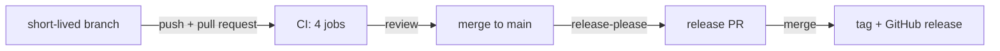

# Git workflow

The repo lives on GitHub at [rootcube/data-mesh-template](https://github.com/rootcube/data-mesh-template).
Humans own git: every branch, commit and pull request is made by a person. `main` only changes
through pull requests, and release-please turns the conventional commits on it into versions,
`CHANGELOG.md` and GitHub releases, so the commit message is the one thing the tooling reads.

!!! danger "AI agents never touch git"
    Agents must not run `git commit`, `git push`, or create branches. Read-only commands
    (`git status`, `git diff`, `git log`) are fine. The agent stops after `just fmt` /
    `just test` / `just validate`; the human reviews and commits. See
    [AI agents](../ai-agents/index.md).

## The workflow



1. **Branch from `main`.** One topic per branch, a few days at most. Work on a branch, not on
   `main`.
2. **Commit.** Pre-commit hooks run on every `git commit` (install them once with
   `just pre-commit-install`). If a hook fails, fix the cause and commit again. Never
   `git commit --no-verify`; CI runs the same checks anyway.
3. **Open a pull request to `main`.** CI runs the four jobs from `.github/workflows/ci.yml` on
   every pull request and on every push to `main`.
4. **Review and merge.** Keep diffs small and single-purpose ("one thing at a time", per
   `AGENTS.md`). A reviewable pull request touches one concern: one dlt load, one dbt model with
   its YAML, one project's Terraform YAML, one docs fix. A squash merge turns the pull request
   title into the commit on `main`, so give the title the same conventional shape.
5. **Release.** release-please keeps a release pull request up to date; merging it is the
   release. See [Releases](#releases).

Terraform changes follow the same path: the YAML under `terraform/config/` is reviewed and
merged like code, and an administrator runs `just tf plan` / `just tf apply` from `main`
afterwards. See [Snowflake provisioning](../administration/snowflake-provisioning.md).

## Branch naming

A suggestion, not a rule: `<type>/<short-topic>`, using the same types as the commit messages
below.

| Example | Use |
|---|---|
| `feat/knmi-daily-aggregate` | New functionality |
| `fix/knmi-hour-24-rollover` | Bug fixes |
| `docs/sql-style-examples` | Documentation only |

## Commit messages

[Conventional commits](https://www.conventionalcommits.org/): a type, an optional scope in
parentheses, and a short imperative subject.

```text
feat(dbt): add int__weather__station_day
fix(dlt): chunk KNMI requests by ten days
feat(terraform)!: rename the layer schemas
docs: rewrite the naming page
chore: bump ruff
```

release-please reads the type: `feat` and `fix` (and `perf`) make a release, a `!` after the
type or a `BREAKING CHANGE:` footer marks a breaking change, everything else (`docs`,
`refactor`, `test`, `chore`, `ci`, `build`, `style`) is kept out of the changelog and releases
nothing on its own. Below 1.0.0 a feature bumps the patch version and a breaking change the
minor version (`bump-minor-pre-major` and `bump-patch-for-minor-pre-major` in
`release-please-config.json`); a `Release-As: 1.0.0` footer forces the first stable version.
Skip other trailers and generated footers.

## Releases

`.github/workflows/release-please.yml` runs on every push to `main`:

1. release-please reads the commits since the last release. Nothing releasable means nothing
   happens.
2. Otherwise it opens or updates the release pull request: the next version in
   `pyproject.toml` and `uv.lock`, and the new section in `CHANGELOG.md`. The pull request keeps
   absorbing merges until someone merges it; that merge is the release gate.
3. Merging it tags `vX.Y.Z` and creates the GitHub release with the changelog section as notes.

`.release-please-manifest.json` holds the last released version; never bump the version in
`pyproject.toml` by hand. The `uv.lock` entry in `release-please-config.json` uses the JSONPath
`$.package[?(@.name.value=='datamesh-starter')].version`, with `.value` because release-please's
TOML parser wraps every scalar in a `{start, end, value}` record.

Tags made with the default `GITHUB_TOKEN` do not start other workflows. A deploy that must
follow a release is chained off the `release_created` and `tag_name` outputs of the
`release-please` job, not off `on: push: tags`.

## Protected main

`main` accepts pull requests only: no direct pushes, no force pushes, no deletion, and the
rule applies to administrators too. The settings are `.github/branch-protection.json`; apply
them once with the GitHub CLI (`just install gh`, then `gh auth login`) or in the repository settings:

```bash
gh api -X PUT repos/rootcube/data-mesh-template/branches/main/protection --input .github/branch-protection.json
```

CI still runs on every pull request, but it is not a required check: release-please opens its
pull requests with `GITHUB_TOKEN`, and GitHub runs no workflows for those, so a required check
would make the release pull request unmergeable. Approvals are set to zero for a single
maintainer; raise `required_approving_review_count` when there are reviewers.

## What runs when

Pre-commit, on every commit, from `.pre-commit-config.yaml`:

| Hook | Fires on | What it does |
|---|---|---|
| `trailing-whitespace`, `end-of-file-fixer`, `check-yaml`, `check-added-large-files`, `check-merge-conflict`, `detect-private-key` | everything | The standard hygiene checks; `detect-private-key` keeps a `.p8` out of the repo |
| `ruff format`, `ruff check --fix` | Python files | Format and lint |
| `ty check` | Python files | Type check the whole project |
| `dbt parse` (all projects, `dummy` target) | anything under `dbt/` | Every project must parse without Snowflake credentials |
| `sqlfluff lint` | `dbt/dbt_example/models/**/*.sql` | The SQL rules; lint only, so run `just fmt` first |
| `dagster definitions validate` | `src/`, `dlt_pipelines/` | Every code location must load |
| `terraform fmt` | `.tf` files | Needs the `terraform` binary, so administrators in practice |
| `validate_configs.py` | `terraform/config/**` | The YAML schemas and cross-references (`just tf-validate-config`) |

`just pre-commit` runs every hook on every file, which is the quickest way to find out what CI
will say.

CI, on every pull request and push to `main`, from `.github/workflows/ci.yml`:

| Job | Runs |
|---|---|
| `python` | `ruff format --check`, `ruff check`, `ty check`, `pytest` |
| `dbt-and-dagster` | `dbt deps` + `dbt parse` in every project (`dummy` target), `sqlfluff lint models`, `dagster definitions validate` |
| `terraform` | `terraform fmt -check`, `terraform init -backend=false`, `terraform validate`, `validate_configs.py` |
| `docs` | `mkdocs build --strict` (a broken link fails the build) |

`just check` runs the first two locally plus the YAML validation of the third;
`just docs build --strict` covers the last one.

release-please, on every push to `main`, from `.github/workflows/release-please.yml`: the release
pull request, and on its merge the tag and the GitHub release. It is not a check on your pull
request.

## Rules recap

- Humans commit; agents stop at `just fmt` / `just test` / `just validate`.
- Branch from `main`, keep branches short-lived, merge through a pull request; `main` accepts
  nothing else.
- Conventional commits, one topic per pull request; release-please turns them into releases.
- Never bypass pre-commit hooks.
- Small, reviewable diffs. Update the docs page in the same pull request when behavior documented
  under `docs/` changes.
