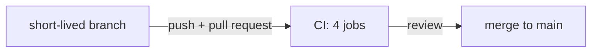

# Git workflow

The repo lives on GitHub at [rootcube/data-mesh-template](https://github.com/rootcube/data-mesh-template).
Humans own git: every branch, commit and pull request is made by a person. There is no release
automation, no changelog tooling and no commit signing requirement, so the workflow is short.

!!! danger "AI agents never touch git"
    Agents must not run `git commit`, `git push`, or create branches. Read-only commands
    (`git status`, `git diff`, `git log`) are fine. The agent stops after `just fmt` /
    `just test` / `just validate`; the human reviews and commits. See
    [AI agents](../ai-agents/index.md).

## The workflow



1. **Branch from `main`.** One topic per branch, a few days at most. Work on a branch, not on
   `main`.
2. **Commit.** Pre-commit hooks run on every `git commit` (install them once with
   `just pre-commit-install`). If a hook fails, fix the cause and commit again. Never
   `git commit --no-verify`; CI runs the same checks anyway.
3. **Open a pull request to `main`.** CI runs the four jobs from `.github/workflows/ci.yml` on
   every pull request and on every push to `main`.
4. **Review and merge.** Keep diffs small and single-purpose ("one thing at a time", per
   `AGENTS.md`). A reviewable pull request touches one concern: one dlt load, one dbt model with
   its YAML, one project's Terraform YAML, one docs fix.

Terraform changes follow the same path: the YAML under `terraform/config/` is reviewed and
merged like code, and an administrator runs `just tf plan` / `just tf apply` from `main`
afterwards. See [Snowflake provisioning](../administration/snowflake-provisioning.md).

## Branch naming

A suggestion, not a rule: `<type>/<short-topic>`, using the same types as the commit messages
below.

| Example | Use |
|---|---|
| `feat/knmi-daily-aggregate` | New functionality |
| `fix/knmi-hour-24-rollover` | Bug fixes |
| `docs/sql-style-examples` | Documentation only |

## Commit messages

[Conventional commits](https://www.conventionalcommits.org/) style is recommended, not enforced:
a type, an optional scope in parentheses, and a short imperative subject.

```text
feat(dbt): add int__weather__station_day
fix(dlt): chunk KNMI requests by ten days
feat(terraform): add the energy project
docs: rewrite the naming page
chore: bump ruff
```

Types that read well here: `feat`, `fix`, `docs`, `refactor`, `test`, `chore`, `ci`. No tooling
reads the prefix (there is no automated version bump or changelog), so its only job is a scannable
history. Skip trailers and generated footers.

## What runs when

Pre-commit, on every commit, from `.pre-commit-config.yaml`:

| Hook | Fires on | What it does |
|---|---|---|
| `trailing-whitespace`, `end-of-file-fixer`, `check-yaml`, `check-added-large-files`, `check-merge-conflict`, `detect-private-key` | everything | The standard hygiene checks; `detect-private-key` keeps a `.p8` out of the repo |
| `ruff format`, `ruff check --fix` | Python files | Format and lint |
| `ty check` | Python files | Type check the whole project |
| `dbt parse` (all projects, `dummy` target) | anything under `dbt/` | Every project must parse without Snowflake credentials |
| `sqlfluff lint` | `dbt/dbt_example/models/**/*.sql` | The SQL rules; lint only, so run `just fmt` first |
| `dagster definitions validate` | `src/`, `dlt_pipelines/` | Every code location must load |
| `terraform fmt` | `.tf` files | Needs the `terraform` binary, so administrators in practice |
| `validate_configs.py` | `terraform/config/**` | The YAML schemas and cross-references (`just tf-validate-config`) |

`just pre-commit` runs every hook on every file, which is the quickest way to find out what CI
will say.

CI, on every pull request and push to `main`, from `.github/workflows/ci.yml`:

| Job | Runs |
|---|---|
| `python` | `ruff format --check`, `ruff check`, `ty check`, `pytest` |
| `dbt-and-dagster` | `dbt deps` + `dbt parse` in every project (`dummy` target), `sqlfluff lint models`, `dagster definitions validate` |
| `terraform` | `terraform fmt -check`, `terraform init -backend=false`, `terraform validate`, `validate_configs.py` |
| `docs` | `mkdocs build --strict` (a broken link fails the build) |

`just check` runs the first two locally plus the YAML validation of the third;
`just docs build --strict` covers the last one.

## Rules recap

- Humans commit; agents stop at `just fmt` / `just test` / `just validate`.
- Branch from `main`, keep branches short-lived, merge through a pull request.
- Conventional-commit style subjects, one topic per pull request.
- Never bypass pre-commit hooks.
- Small, reviewable diffs. Update the docs page in the same pull request when behavior documented
  under `docs/` changes.
