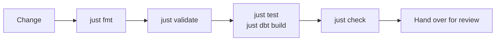

# Development

Four kinds of change cover almost everything an engineer does here: a new dlt load, a new dbt
model, a whole new project (a node in the mesh), or a plain Python asset. Each has its own
walkthrough. They all end the same way: the validation loop below, then hand the change over for
review.

## The how-tos

- :material-database-import:{ .lg .middle } **[Adding a dlt load](adding-dlt-loads.md)**

    ---

    A second REST source next to `knmi`: the folder, the `source` and `pipeline` objects, the
    `defs.yaml`, the dbt source and staging model.

- :material-database-plus:{ .lg .middle } **[Adding a dbt model](adding-dbt-models.md)**

    ---

    An INT or MRT model on top of `stg__knmi__climate_hourly`: the SQL, its `_conf` YAML, tests,
    the layer rules, sqlfluff.

- :material-folder-plus:{ .lg .middle } **[Adding a project](adding-projects.md)**

    ---

    A new node in the mesh: the Terraform YAML and the Snowflake objects it creates, a dbt
    project next to `dbt_example`, its own Dagster code location.

- :material-language-python:{ .lg .middle } **[Adding Python assets](adding-python-assets.md)**

    ---

    A plain `@asset` in a code location, with the Snowflake resource when it needs one.

- :material-test-tube:{ .lg .middle } **[Testing](testing.md)**

    ---

    pytest, dbt tests, `just validate`, `just check`, the pre-commit hooks and what CI runs.

## Where you work

An engineer works in the development environment of one project: the shared database
`DB_<PROJECT>_DEV`, personal schemas prefixed with your `SNOWFLAKE_SCHEMA` (`DBT_<USERNAME>_SRC`,
`DBT_<USERNAME>_STG`, ..., provisioned for you by Terraform), the project's engineer role `RL_<PROJECT>_DEV__ENG` and its warehouse
`WH_<PROJECT>_DEV`. `just sf setup` writes those into `.env`; nothing else needs
configuring. The starter ships one project, `example`, so out of the box that is
`DB_EXAMPLE_DEV`. The other environments (`tst`, `acc`, `prd`) use the provisioned `_<LAYER>`
schemas and are not where you develop. Background: [Environment](../concepts/environment.md)
and [Snowflake](../architecture/snowflake.md).

## The validation loop

| Step | Command | Catches |
|------|---------|---------|
| Format | `just fmt` | ruff format and lint fixes, `sqlfluff fix models` in the dbt project |
| Wire-up | `just validate` | Every code location loads: import errors, broken `defs.yaml`, dbt parse errors, missing `dbt deps` |
| Behaviour | `just test`, `just dbt build --select <model>+` | Python unit tests; dbt models, seeds and data tests in your personal schemas |
| Everything CI does | `just check` | `lint` + `typecheck` + `test`, then `dbt parse --target dummy` in every project, `dagster definitions validate` and the Terraform YAML validation |

Details, including the pre-commit hooks and the CI jobs, are on [Testing](testing.md).

!!! note "Verify before you say it works"
    A code location that loads is not the same as a pipeline that ran. For a dlt change, run it
    (`just dlt run <source>`) and count rows (`just sf query "SELECT COUNT(1) FROM ..."`).
    For a dbt change, `just dbt build --select <model>` and read the summary.

## Where things go

| Change | Files | Rule of thumb |
|--------|-------|---------------|
| dlt load | `dlt_pipelines/pipelines/ingest/<source>/` + `dbt/<project>/sources/src_<source>.yml` + a staging model | One folder per source, module-level `source` and `pipeline`, tables `<source>__<entity>` in `_SRC` |
| dbt model | `dbt/<project>/models/<layer>/<domain>/<name>.sql` + `_conf/<name>.yml` | Reference only the layer below; every model has its YAML |
| project | `terraform/config/projects/<project>.yaml` + `dbt/dbt_<project>/` + `src/orchestrator/locations/dbt/dbt_<project>/` + `workspace.yaml` | One project per mesh node, one location per project, `dbt_common` built by one project only |
| Python asset | A module in the owning location, merged into its `definitions.py` | A genuinely separate concern is a new location in `workspace.yaml` |

The naming rules for all of these are on [Naming](../conventions/naming.md); the git side
(branches, commits, review) on [Git workflow](../conventions/git-workflow.md).
