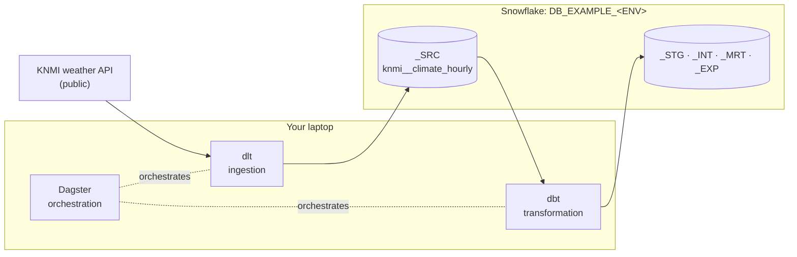

# Data Mesh Platform Starter

A runnable starter for a **data mesh platform on Snowflake**. Dagster orchestrates, dlt ingests,
dbt transforms, Terraform provisions. It implements the conceptual model of
[rootcube/platform](https://github.com/rootcube/platform): an **organisation** has **teams**, a
team owns **projects**, a project exists in **environments**, and every project and environment
pair gets its **layers** (schemas), **roles** (grants) and **computes** (warehouses) in Snowflake.
One small repository that runs on a laptop and grows into a mesh of projects.

[:material-rocket-launch: Get started](getting-started/index.md){ .md-button .md-button--primary }
[:material-shape-outline: Concepts](concepts/index.md){ .md-button }
[:material-shield-account: Administration](administration/index.md){ .md-button }

---



In development every engineer gets personal copies of those schemas (`DBT_<USERNAME>_SRC`,
`DBT_<USERNAME>_STG`, ...) inside the shared `DB_EXAMPLE_DEV`. The other environments use the
provisioned `_<LAYER>` schemas.

## Two kinds of readers

**Engineers** work in the repository: they add dlt loads, dbt models and Python assets and run
them through Dagster. Start at [Getting started](getting-started/index.md).

**Platform administrators** run Terraform: they bootstrap the Snowflake account, describe the
mesh in YAML and onboard people. Start at [Administration](administration/index.md).

<div class="grid cards" markdown>

-   :material-rocket-launch:{ .lg .middle } **Getting started**

    ---

    Four commands from a fresh clone to a running Dagster UI: install, one-time Snowflake
    login with key-pair setup, check, start.

    [:octicons-arrow-right-24: Quickstart](getting-started/index.md)

-   :material-shape-outline:{ .lg .middle } **Concepts**

    ---

    Organisation, team, project, environment, layer, role and compute: the model behind every
    name in Snowflake and every folder in the repo.

    [:octicons-arrow-right-24: The model](concepts/index.md)

-   :material-sitemap:{ .lg .middle } **Architecture**

    ---

    How the dlt pipelines, the layered dbt projects and the Dagster code locations fit
    together, and what the model looks like in Snowflake.

    [:octicons-arrow-right-24: Overview](architecture/index.md)

-   :material-hammer-wrench:{ .lg .middle } **Development**

    ---

    Task-oriented guides: add a dlt load, a dbt model, a whole project, or a Python asset, and
    test your work.

    [:octicons-arrow-right-24: How-tos](development/index.md)

-   :material-ruler-square:{ .lg .middle } **Conventions**

    ---

    Python and SQL style, the dbt style guide, naming, git workflow. The same rules a
    production platform uses.

    [:octicons-arrow-right-24: House rules](conventions/index.md)

-   :material-robot:{ .lg .middle } **AI agents**

    ---

    Working on this repo with coding agents: the instruction set in `AGENTS.md` plus
    per-technology guides and standards.

    [:octicons-arrow-right-24: Agent guide](ai-agents/index.md)

-   :material-shield-account:{ .lg .middle } **Administration**

    ---

    Bootstrap the Snowflake account, turn YAML into databases, schemas, roles and warehouses
    with Terraform, and onboard people and service users.

    [:octicons-arrow-right-24: Runbooks](administration/index.md)

-   :material-book-open-variant:{ .lg .middle } **Reference**

    ---

    Every `just` command, every environment variable, and a glossary of concept and tool
    terms.

    [:octicons-arrow-right-24: Look it up](reference/index.md)

</div>

## The platform at a glance

| Component | Role | Where |
|-----------|------|-------|
| [Dagster](https://docs.dagster.io/) | Orchestrates everything: one code location for dlt, one per dbt project | `src/orchestrator/locations/`, `workspace.yaml` |
| [dlt](https://dlthub.com/docs) | Ingests sources into the source layer as `<source>__<entity>` tables | `dlt_pipelines/` |
| [dbt](https://docs.getdbt.com/) | Transforms inside Snowflake through `_STG`, `_INT`, `_MRT`, `_EXP` | `dbt/` (`dbt_common` package + one project per Project) |
| [Terraform](https://developer.hashicorp.com/terraform) | Provisions databases, schemas, roles and warehouses from YAML (administrators) | `terraform/` |
| [Snowflake](https://docs.snowflake.com/) | One database per project and environment: `DB_<PROJECT>_<ENV>` | the account your administrator provisions |

The starter ships one organisation (`example`), one team (`platform`) and one project
(`example`) with the environments development and production. Terraform turns that into
`DB_EXAMPLE_DEV` and `DB_EXAMPLE_PRD`, the roles `RL_EXAMPLE_<ENV>__ENG`, `__ANL`, `__ING` and
`__TFM`, and the warehouses `WH_EXAMPLE_DEV` and `WH_EXAMPLE_PRD`.

!!! tip "In a hurry?"
    ```bash
    git clone git@github.com:rootcube/data-mesh-template.git && cd data-mesh-template
    just init              # uv, .venv, .env, dbt packages
    just snowflake setup   # one-time login, key pair registered on your user, .env filled in
    just setup             # fresh account instead of the two lines above: also bootstraps Terraform and provisions the project
    just snowflake check   # proves key-pair login works
    just start             # Dagster UI on http://localhost:3000
    ```
