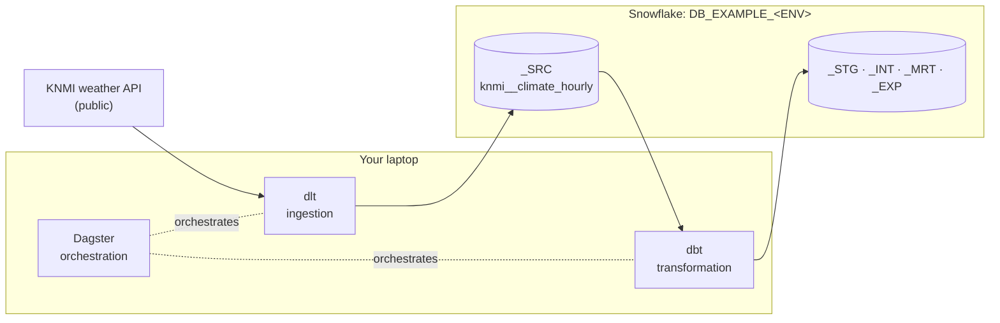

# Data Mesh Platform Starter

A runnable starter for a data mesh platform on Snowflake: Dagster orchestrates, dlt ingests, dbt
transforms, Terraform provisions. It ships one finished project, from a public weather API through
the layer schemas to a published view, so the whole shape is in front of you before you write a
line of your own.

Trying it costs a free [Snowflake trial](https://signup.snowflake.com/) (30 days, no card) and an
afternoon. Everything else runs on your laptop. The example loads Dutch weather observations,
which have the twin virtues of being free and never quite the same twice.

## From clone to a running UI

```bash
git clone https://github.com/rootcube/data-mesh-template.git && cd data-mesh-template
just init        # uv, the virtual environment, .env and the dbt packages
just setup       # one question: a fresh Snowflake account, or one an administrator provisioned
just start       # Dagster on http://localhost:3000
```

`just setup` runs `just init` itself, so on a fresh clone you can go straight to it. On a trial
account it also bootstraps Snowflake and provisions the example project, which takes about fifteen
minutes: [Snowflake trial account](operate/snowflake-trial-account-setup.md) walks through it.


```mermaid
flowchart LR
    API["KNMI weather API<br/>(public)"]
    subgraph laptop["Your laptop"]
        DAGSTER["Dagster<br/>orchestration"]
        DLT["dlt<br/>ingestion"]
        DBT["dbt<br/>transformation"]
    end
    subgraph sf["Snowflake: DB_EXAMPLE_&lt;ENV&gt;"]
        SRC[("_SRC<br/>knmi__climate_hourly")]
        LAYERS[("_STG · _INT · _MRT · _EXP")]
    end

    API --> DLT --> SRC
    SRC --> DBT --> LAYERS
    DAGSTER -.orchestrates.- DLT & DBT
```

Every engineer builds into personal schemas (`DBT_<USERNAME>_SRC`, `DBT_<USERNAME>_STG`, ...) of
the shared development database, so a laptop never writes where production reads.

## Where to go

<div class="grid cards" markdown>

-   :material-rocket-launch:{ .lg .middle } **[Start](start/index.md)**

    ---

    Get it running: prerequisites, `just init`, key-pair authentication, your first load and
    build. Plus troubleshooting, and how to make the starter your own platform.

-   :material-hammer-wrench:{ .lg .middle } **[Build](build/index.md)**

    ---

    Add a dlt load, a dbt model, a Python asset, or a whole new project to the mesh, and test
    the result.

-   :material-shield-account:{ .lg .middle } **[Operate](operate/index.md)**

    ---

    For whoever holds the Snowflake account: provision it from YAML with Terraform, onboard
    people and service users, or spin up a trial account to try the lot.

-   :material-shape-outline:{ .lg .middle } **[Understand](understand/index.md)**

    ---

    The platform model (organisation, team, project, environment, layer, role, access, compute)
    and how dlt, dbt, Dagster and Snowflake fit around it.

-   :material-book-open-variant:{ .lg .middle } **[Reference](reference/index.md)**

    ---

    Python, SQL and dbt conventions, naming, git workflow, every `just` command, every
    environment variable, a glossary, and a page written for AI agents.

</div>
