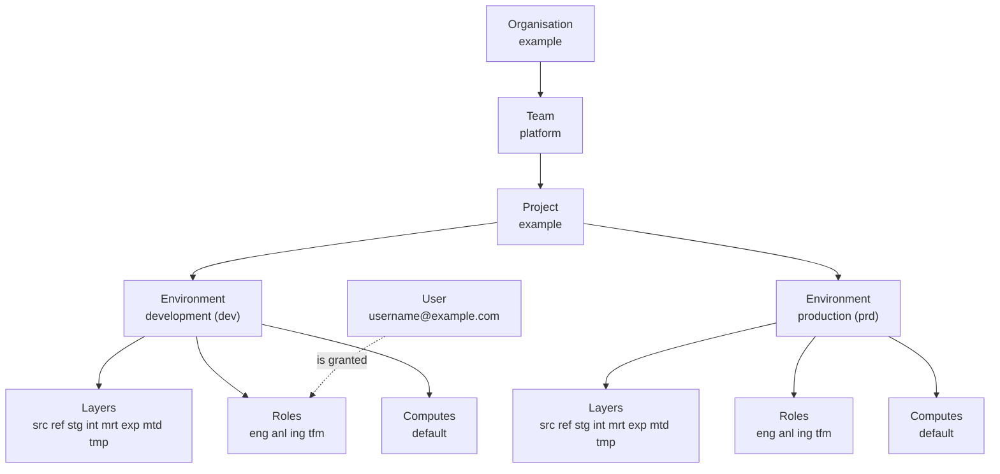
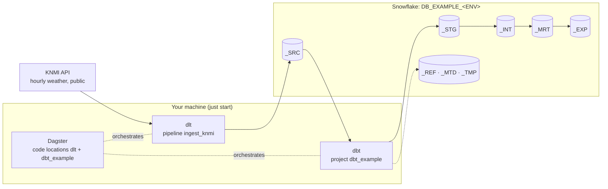

# Understand

This starter implements the conceptual model of
[rootcube/platform](https://github.com/rootcube/platform): a small set of vendor-agnostic
primitives that say *what* exists in a data mesh platform and *why*. The concepts stay stable.
Snowflake, Dagster, dlt and Terraform are the implementation, and they may change without
touching the model.

## The platform model

An **Organisation** has **Teams**. A Team owns **Projects**. A Project exists in
**Environments**. Every Project × Environment has **Layers**, **Roles** and **Computes**; a Role
holds an **Access** tier per Layer; **Users**, people and services, are granted Project Roles.

The starter ships one of each: the project `example`, owned by the team `platform`, in
`development` and `production`.



Every box is a YAML file under `terraform/config/`, and `just tf plan --all` shows what Terraform
turns it into.

| Concept | Defined in `terraform/config/` | Becomes in Snowflake | Shows up in the repo as |
|---------|-------------------------------|----------------------|-------------------------|
| [Organisation](organisation.md) | `organisations/example.yaml` | The Snowflake account itself; no object is created | `SNOWFLAKE_ACCOUNT` (`<organization>-<account>`) |
| [Team](team.md) | `teams/platform.yaml` | Nothing; ownership metadata that projects point at | `owners` in the YAML |
| [Project](project.md) | `projects/example.yaml` | One database per environment: `DB_EXAMPLE_DEV`, `DB_EXAMPLE_PRD` | `dbt/dbt_example/`, `src/orchestrator/locations/dbt/dbt_example/`, one entry in `workspace.yaml` |
| [Environment](environment.md) | `environments/*.yaml` | The `<ENV>` segment of every database, role and warehouse name | `ENVIRONMENT` in `.env`, which picks the dbt target and the schema naming |
| [Layer](layer.md) | `layers/*.yaml` | A schema `_<LAYER>` in each project database (`_SRC`, `_STG`, `_MRT`, ...) | dbt `+schema` per model folder; the dlt dataset |
| [Role](role.md) | `roles/*.yaml` | An account role `RL_<PROJECT>_<ENV>__<PURPOSE>` with an access tier per layer and grants per compute | `SNOWFLAKE_ROLE` |
| [Access](access.md) | `accesses/*.yaml` | An access role `AR_<PROJECT>_<ENV>__<LAYER>__<ACCESS>` per layer and tier (`VIEW`, `READ`, `EDIT`, `FULL`), holding the privileges, granted to the project roles that name it | Nothing directly; roles reach it through inheritance |
| [Compute](compute.md) | `computes/*.yaml` | A warehouse `WH_<PROJECT>_<ENV>[__<COMPUTE>_<SIZE>]` | `SNOWFLAKE_WAREHOUSE` |
| Users (on the [Role](role.md#users) page) | `users/*.yaml` | Role grants to a login, and optionally the user itself | `SNOWFLAKE_USER` |

## The four tools

One small platform with the shape of a big one: **dlt** ingests into **Snowflake**, **dbt**
transforms inside it, **Dagster** orchestrates both, **Terraform** provisions the Snowflake
side. An engineer runs all of it from one repository on their own machine.



dlt merges the last 30 days of hourly observations for seven KNMI stations into
`knmi__climate_hourly`. dbt declares that table as a source and builds the layers on top of it.
Dagster shows both as one asset graph, across two code locations that never import each other.
Everything lands in one database per environment, `DB_EXAMPLE_<ENV>`.

| Tool | Does | Lives in | Page |
|------|------|----------|------|
| dlt | Ingests REST sources into the source layer as `<source>__<entity>` tables, one folder per source | `dlt_pipelines/`, `.dlt/config.toml` | [Ingestion](ingestion.md) |
| dbt | Transforms inside Snowflake through numbered layer folders, one dbt project per mesh node | `dbt/` | [Transformation](transformation.md) |
| Dagster | Orchestrates both as assets, one code location per concern | `src/orchestrator/`, `workspace.yaml` | [Orchestration](orchestration.md) |
| Terraform | Turns the YAML under `terraform/config/` into Snowflake objects. Administrators only | `terraform/` | [Snowflake](snowflake.md) |

The repository, top level only:

```
workspace.yaml        # the authoritative list of Dagster code locations
justfile              # every command (run bare `just` to list them)
.env.example          # ENVIRONMENT, SNOWFLAKE_*, DBT_TARGET, RUNTIME__LOG_LEVEL, TF_VAR_SNOWFLAKE_*
src/orchestrator/     # the Dagster package: code locations, resources, the Snowflake settings reader
dlt_pipelines/        # one folder per source under pipelines/ingest/, plus the shared destination
dbt/                  # profiles.yml, the dbt_common package, one project per mesh node
terraform/            # config/*.yaml, the Snowflake modules, and the bootstrap SQL
scripts/              # snowflake.py (key pairs), info.py, dbt_all.py
tests/                # pytest, offline only
.dagster/ .dlt/       # local instance and pipeline state, git-ignored apart from the config files
docs/ mkdocs.yml      # this site
```

## Two personas

Engineer
:   Works in the repository: dlt pipelines, dbt models, Dagster code locations. Authenticates
    with a personal key pair, holds the engineer role of a project, and in development works in
    personal schemas of the shared development database. Never needs Terraform.

Platform administrator
:   Owns `terraform/`. Bootstraps the account once, edits the YAML under `terraform/config/`,
    runs `just tf plan --all` and `just tf apply --all`, and onboards people and service users. The runbook
    is [Snowflake provisioning](../operate/snowflake-provisioning.md).

## What is deliberately not a concept

The model keeps its primitives few, and this repo follows that. A **domain** is a business
construct that shifts over time, so domain alignment is expressed through Teams and Projects;
here a domain is only a naming segment (`int__<domain>__<entity>`). A **pipeline** or
**workflow** is an implementation artefact, transient and without ownership, living inside a
Project rather than next to it. A **data product** is derived: whatever a Project publishes
through its expose layer, with the owning Team accountable for the contract. And an **asset**,
**dataset**, **table** or **view** is a physical artefact that exists within a Layer, a Project
and an Environment, governed through Roles, so it needs no concept of its own.

## What the starter adds

[Snowflake provisioning](../operate/snowflake-provisioning.md#differences-from-rootcubeplatform)
lists what this repo adds on top of rootcube/platform, kept small so it can flow back upstream:
user files under `config/users/` that grant project roles to a login;
a `personal` block on a role, for the per-engineer schemas in `dev`; `privileges.database` for
extra database privileges (no shipped role needs any); the metadata layer `_MTD`, where dbt
writes its run metadata; and `config/accesses/`, which is what lets a role name a tier per
layer instead of a list of privileges. Snowflake is the only provider the starter implements.

## Where to go next

- The model, concept by concept: [Organisation](organisation.md), [Team](team.md),
  [Project](project.md), [Environment](environment.md), [Layer](layer.md), [Role](role.md),
  [Access](access.md), [Compute](compute.md)
- How it fits together: [Ingestion](ingestion.md), [Transformation](transformation.md),
  [Orchestration](orchestration.md), [Snowflake](snowflake.md)
- Ready to change something? [Build](../build/index.md) has a how-to per kind of change
- [Naming](../reference/naming.md): every name pattern in one place
