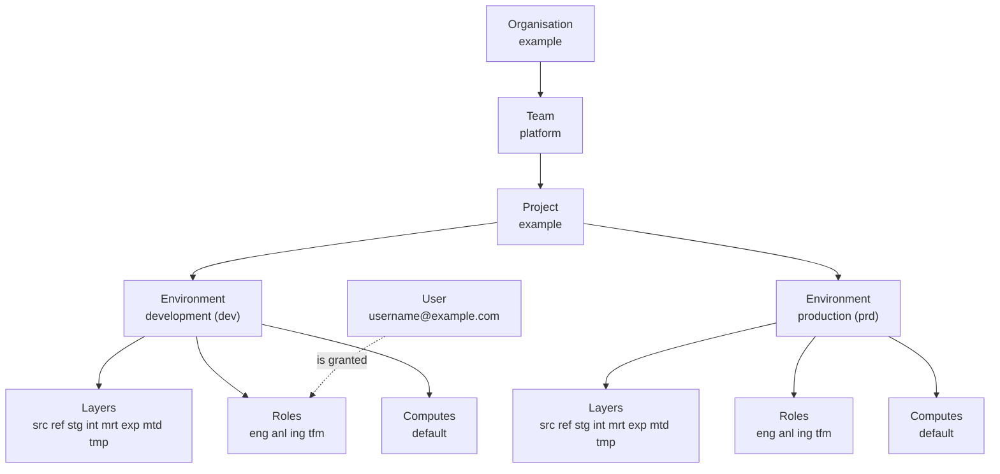
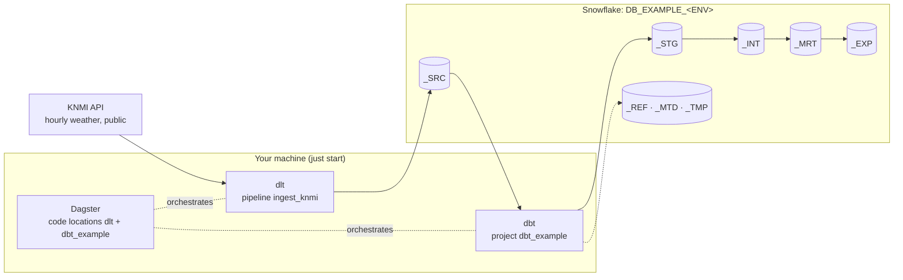

# Concepts

This starter implements the conceptual model of
[rootcube/platform](https://github.com/rootcube/platform): a small set of vendor-agnostic
primitives that say *what* exists in a data mesh platform and *why*, independent of the tools
that implement them. The concepts stay stable. The components (Snowflake, Dagster, dlt, dbt,
Terraform) are the implementation, and they may change without touching the model.

The model is a hierarchy. An **Organisation** has **Teams**. A Team owns **Projects**. A Project
exists in **Environments**. Every Project × Environment has **Layers**, **Roles** and
**Computes**. A Role holds an **Access** tier per Layer. **Users**, people and services, are
granted Project Roles.



The diagram shows the project the starter ships with. Every box is a YAML file under
`terraform/config/`, and `just tf plan` shows what Terraform turns it into.

## Concept by concept

| Concept | Defined in `terraform/config/` | Becomes in Snowflake | Shows up in the repo as |
|---------|-------------------------------|----------------------|-------------------------|
| [Organisation](organisation.md) | `organisations/example.yaml` | The Snowflake account itself; no object is created | `SNOWFLAKE_ACCOUNT` (`<organization>-<account>`) |
| [Team](team.md) | `teams/platform.yaml` | Nothing; ownership metadata that projects point at | `owners` in the YAML |
| [Project](project.md) | `projects/example.yaml` | One database per environment: `DB_EXAMPLE_DEV`, `DB_EXAMPLE_PRD` | `dbt/dbt_example/`, `src/orchestrator/locations/dbt/dbt_example/`, one entry in `workspace.yaml` |
| [Environment](environment.md) | `environments/*.yaml` | The `<ENV>` segment of every database, role and warehouse name | `ENVIRONMENT` in `.env`, which picks the dbt target and the schema naming |
| [Layer](layer.md) | `layers/*.yaml` | A schema `_<LAYER>` in each project database (`_SRC`, `_STG`, `_MRT`, ...) | dbt `+schema` per model folder; the dlt dataset |
| [Role](role.md) | `roles/*.yaml` | An account role `RL_<PROJECT>_<ENV>__<PURPOSE>` with an access tier per layer and grants per compute | `SNOWFLAKE_ROLE` |
| [Access](access.md) | `accesses/*.yaml` | An access role `AR_<PROJECT>_<ENV>__<LAYER>__<ACCESS>` per layer and tier (`VIEW`, `READ`, `EDIT`, `FULL`), holding the privileges, granted to the project roles that name it | Nothing directly; roles reach it through inheritance |
| [Compute](compute.md) | `computes/*.yaml` | A warehouse `WH_<PROJECT>_<ENV>[__<COMPUTE>_<SIZE>]` | `SNOWFLAKE_WAREHOUSE` |
| Users (on the [Role](role.md#users) page) | `users/*.yaml` | Role grants to a login, and optionally the user itself | `SNOWFLAKE_USER` |

Each concept page shows the YAML that defines it, the Snowflake objects it becomes and where
the repo relies on it. [Architecture](index.md) covers the same ground from the
tooling side.

## Two personas

Engineer
:   Works in the repository: dlt pipelines, dbt models, Dagster code locations. Authenticates
    with a personal key pair, holds the engineer role of a project, and in development works
    in personal schemas of the shared development database. Never needs Terraform.

Platform administrator
:   Owns `terraform/`. Bootstraps the account once, edits the YAML under `terraform/config/`,
    runs `just tf plan` and `just tf apply`, and onboards people and service users. The
    runbook is [Snowflake provisioning](../operate/snowflake-provisioning.md).

## What is deliberately not a concept

The platform model keeps its concepts few and fundamental. Four familiar words are left out on
purpose, and this repo follows that:

Domain
:   A business construct that changes over time. Domain alignment is expressed through Teams
    and Projects. In this repo a domain is only a naming segment: the `<domain>` in
    `int__<domain>__<entity>` and the folder under `models/<layer>/<domain>/`.

Pipeline, workflow
:   Implementation artefacts of the orchestration component. A dlt pipeline or a Dagster job
    is transient and carries no ownership. They live inside a Project, not next to it.

Data product
:   A derived idea, not a primitive. A data product is whatever a Project exposes through its
    expose layer (`_EXP`), with the owning Team accountable for the contract.

Asset, dataset, table, view
:   Physical artefacts produced by components. They exist *within* Layers, Projects and
    Environments and are governed through Roles. A dlt table in `_SRC` or a dbt model in
    `_MRT` needs no concept of its own.

## The rules, in short

The platform states its rules as numbered invariants. These are the ones the starter enforces
or relies on, with the place they bite.

| Rule | Where it shows up here |
|------|------------------------|
| A Project has exactly one owning Team | `team:` in `projects/example.yaml`; the validator rejects an unknown team |
| Environments are lifecycle boundaries: no implicit sharing of data, compute or credentials | A database, a warehouse and a set of roles per environment; a key pair per user |
| Layers are semantic conventions, not security boundaries | Access comes from the access roles a role holds per layer, not from the schema itself |
| Roles are scoped to Project × Environment | `RL_EXAMPLE_DEV__ENG` is a different role from `RL_EXAMPLE_PRD__ENG` |
| Compute is isolated per Project × Environment | `WH_EXAMPLE_DEV` and `WH_EXAMPLE_PRD` are separate warehouses |
| Cross-project consumption happens via the expose layer only | A second project reads another project's `_EXP` as a dbt source; nothing else |
| Human access to production is read-only by default | `roles/engineer.yaml` holds the `read` tier in `prd`; `full` belongs to the transform and ingest system roles |
| Changes are promoted forward, dev to prd | `ENVIRONMENT` selects the target; the same code runs in every environment |
| A model references only the layer directly below it | The dbt layer rule, checked in review (see [Layers in practice](layer.md)) |
| One dbt project and one Dagster code location per Project | `dbt/dbt_<project>/` plus `src/orchestrator/locations/dbt/dbt_<project>/` |
| Exactly one project builds the `dbt_common` models | Duplicate asset keys across code locations are an error in Dagster |

## Five additions to the platform model

`terraform/README.md` lists what this starter adds on top of rootcube/platform, kept small so
they can flow back upstream:

1. `config/users/` and `users.tf`: role grants to logins, and optional user creation.
2. `personal` on a role and `personal.tf`: personal schemas per user holding the role. The
   engineer role gets them in `dev`, prefixed with the user file's `schema_prefix` or
   `DBT_<USERNAME>`.
3. `privileges.database` on a role: extra database privileges per environment on top of the
   implicit `USAGE`; none of the shipped roles needs any.
4. `config/layers/metadata.yaml` (`_MTD`): the layer where dbt writes run metadata.
5. `config/accesses/` and the access roles: roles name a tier (`view`, `read`, `edit`, `full`)
   per layer instead of listing privileges, and the privileges live on one access role per
   layer and tier ([Access](access.md)).

The platform repository's other providers are not part of the starter. The provider is
Snowflake only.

## Where to go next

- [Architecture](index.md): how Terraform, dbt, dlt and Dagster implement the concepts
- [Snowflake provisioning](../operate/snowflake-provisioning.md): the administrator runbook
- [Naming](../reference/naming.md): every name pattern in one place

<!-- MERGE-ME: everything below came verbatim from docs/architecture/index.md; fold it into this page and delete this marker -->

---
icon: material/sitemap
---

# Architecture

One small platform with the shape of a big one: **Dagster** orchestrates, **dlt** ingests into
**Snowflake**, **dbt** transforms inside Snowflake, **Terraform** provisions the Snowflake side.
An engineer runs all of it from one repository on their own machine, against a project
database that Terraform created. This page is the map. The other pages in this section each go
deep on one part; the model behind the names is on [Concepts](index.md).

## The platform in one diagram



1. **dlt** fetches the last 30 days of hourly observations (never before 2026-01-01) for seven KNMI stations and merges
   them into `knmi__climate_hourly` in the source layer. The pipeline is
   `dlt_pipelines/pipelines/ingest/knmi/`.
2. **dbt** declares that table as a source and builds the layers `_STG`, `_INT`, `_MRT` and
   `_EXP`. Seeds go to `_REF`, run metadata to `_MTD`, stored test failures to `_TMP`. The
   project is `dbt/dbt_example/`, with the shared `dbt/dbt_common/` package installed into it.
3. **Dagster** shows both as one asset graph. The dlt asset `dlt/ingest/knmi/climate_hourly`
   feeds the dbt asset `dbt_example/models/02_stg/knmi/stg__knmi__climate_hourly`, even though the two live in different
   code locations. `workspace.yaml` lists those locations.

Everything lands in one database per environment, `DB_EXAMPLE_<ENV>`. In development the
database is shared and every engineer works in personal schemas, `DBT_<USERNAME>_<LAYER>`; in the
other environments the tools write to the provisioned `_<LAYER>` schemas.

## Components

| Component | Role | Where in the repo | Detail |
|-----------|------|-------------------|--------|
| Dagster | Orchestrates everything. One code location per concern, loaded from `workspace.yaml`. Local instance state in `.dagster/` | `src/orchestrator/locations/`, `workspace.yaml`, `.dagster/dagster.yaml` | [Orchestration](orchestration.md) |
| dlt | Ingests REST sources into the source layer as `<source>__<entity>` tables. One folder per source with a module-level `source` and `pipeline` | `dlt_pipelines/`, `.dlt/config.toml` | [Ingestion](ingestion.md) |
| dbt | Transforms inside Snowflake through numbered layer folders. Shared `profiles.yml`, a `dbt_common` package and one project per mesh node | `dbt/` | [Transformation](transformation.md) |
| Snowflake | The project databases, roles and warehouses. Key-pair authentication, one settings reader | `.env`, `src/orchestrator/resources/snowflake.py`, `dbt/profiles.yml` | [Snowflake](snowflake.md) |
| Terraform | Turns the YAML under `terraform/config/` into Snowflake objects. Platform administrators only | `terraform/` | [Snowflake provisioning](../operate/snowflake-provisioning.md) |

## How each tool implements the concepts

Terraform
:   Reads `terraform/config/` and creates, per project and environment, a database
    `DB_<PROJECT>_<ENV>`, a schema `_<LAYER>` per layer, a role
    `RL_<PROJECT>_<ENV>__<PURPOSE>` per role with grants per compute, an access role
    `AR_<PROJECT>_<ENV>__<LAYER>__<ACCESS>` per layer and tier that the roles inherit,
    and a warehouse `WH_<PROJECT>_<ENV>[__<COMPUTE>_<SIZE>]` per compute and size. Users get role grants, and
    engineers their personal schemas `<PREFIX>_<LAYER>` in `dev`.

dbt
:   One dbt project per Project (`dbt/dbt_example`). The shared profile `default` has one
    target per environment and follows `ENVIRONMENT`. Each layer folder carries a `+schema`
    (`stg`, `int`, `mrt`, `exp`, `ref`, `tmp`) and `dbt_common.generate_schema_name` turns it
    into `_<LAYER>`, or `<SNOWFLAKE_SCHEMA>_<LAYER>` in `dev`.

dlt
:   Every pipeline loads into the source layer: `source_dataset()` returns `_SRC` or
    `<SNOWFLAKE_SCHEMA>_SRC`, and the table is named `<source>__<entity>`. Role, warehouse and
    database come from the same `SNOWFLAKE_*` variables as everything else.

Dagster
:   One code location per concern: `dlt` for every load, `dbt_<project>` per dbt project. Asset
    keys carry the project and path (`dbt_example/models/02_stg/knmi/stg__knmi__climate_hourly`) or the load
    (`dlt/ingest/knmi/climate_hourly`). Dagster runs with the same `.env`, so it works in the
    environment the checkout is configured for.

## Repository layout

```
workspace.yaml                    # the authoritative list of Dagster code locations
justfile                          # every command (run bare `just` to list them)
.env.example                      # ENVIRONMENT, SNOWFLAKE_*, DBT_TARGET, RUNTIME__LOG_LEVEL, TF_VAR_SNOWFLAKE_*
src/orchestrator/                 # Dagster package
├── locations/dlt/definitions.py  #   code location "dlt": the dlt_pipelines component tree, per source folder job__dlt__ingest_<source> + daily schedule, job__dlt__ingest_all + opt-in schedule
├── locations/dbt/shared.py       #   build_dbt_defs(): one code location per dbt project, with its jobs (job__<location>__<name>) and `dbt` resource
├── locations/dbt/source_freshness.py  # the freshness chain of a dbt location: hourly dbt source freshness, sensor, build_fresher job
├── locations/dbt/dbt_example/    #   code location "dbt_example": definitions.py + defs/dbt/defs.yaml
├── resources/snowflake.py        #   SnowflakeSettings.from_env(): the only reader of SNOWFLAKE_* and ENVIRONMENT
└── utils/dotenv.py               #   .env editing used by scripts/snowflake.py
dlt_pipelines/                    # dlt package
├── __main__.py                   #   `just dlt list` / `just dlt run <source>`
├── pipelines/ingest/knmi/        #   constants.py, source.py, pipelines.py, defs.yaml
└── utils/destination.py          #   the Snowflake destination and the source-layer dataset
dbt/
├── profiles.yml                  #   shared profile `default`: dev, tst, acc, prd + dummy
├── .sqlfluff                     #   shared lint config: dbt templater with the dummy target
├── dbt_common/                   #   package: macros, generic tests, seeds, generic dims
└── dbt_example/                  #   project: models/02_stg 03_int 04_mrt 05_exp, sources/, seeds/, exposures/
terraform/                        # platform administrators: config/*.yaml -> Snowflake
├── README.md                     #   the runbook
├── config/                       #   organisations, teams, projects, environments, layers, roles, computes, users, privileges
├── modules/snowflake/            #   database, schema, role, warehouse and grant modules; init.sql and account_settings.sql (bootstrap)
└── main.tf users.tf personal.tf stages.tf variables.tf outputs.tf providers.tf
scripts/                          # snowflake.py (key pairs), info.py, dbt_all.py
tests/                            # pytest, offline only
.dagster/dagster.yaml             # DAGSTER_HOME (state is git-ignored, this file is not)
.dlt/config.toml                  # dlt runtime settings (no credentials)
docs/ + mkdocs.yml                # this site
overrides/                        # Zensical template overrides (page icons in the tabs)
```

## How the pieces connect

One settings reader
:   `SnowflakeSettings.from_env()` in `src/orchestrator/resources/snowflake.py` reads the
    `SNOWFLAKE_*` variables and `ENVIRONMENT` from `.env`. The dlt destination, the Dagster
    Snowflake resource and `scripts/snowflake.py` all go through it; `dbt/profiles.yml` reads
    the same variable names with `env_var()`. When a connection fails, there is one place to
    look.

One environment file
:   `just` loads `.env` into every recipe and exports `DAGSTER_HOME`, `DLT_PROJECT_DIR`,
    `DLT_DATA_DIR` and `DBT_PROFILES_DIR` itself. `.envrc` does the same for direnv users. See
    [Environment variables](../reference/environment-variables.md).

One schema rule, implemented twice
:   `SnowflakeSettings.schema_for_layer()` (Python) and `dbt_common.generate_schema_name`
    (Jinja) both map a layer to `_<LAYER>`, or to `<SNOWFLAKE_SCHEMA>_<LAYER>` in `dev` (the
    unprovisioned `DBT_<LAYER>` when the prefix is blank). The dbt source YAML repeats the rule
    from the dbt `target`, because source YAML cannot call macros.

Shared asset keys, no imports
:   The Dagster code locations load in separate subprocesses and never import each other. The
    dbt source `knmi.climate_hourly` carries `config.meta.dagster.asset_key: ["dlt", "ingest",
    "knmi", "climate_hourly"]`, the exact key the dlt component produces, so Dagster draws the
    edge between them.

## Detail pages

| Page | Covers |
|------|--------|
| [Layers in practice](layer.md) | What each layer holds in this repo, the folder-to-schema mapping, the naming rule, the reference rule, the `dbt_common` dimensions |
| [Ingestion (dlt)](ingestion.md) | Source, resource and pipeline, merge on a primary key, the Snowflake destination, the Dagster component, the standalone runner |
| [Transformation (dbt)](transformation.md) | The shared profile and its targets, the `dbt_common` package, the `dbt_example` project, hooks and run metadata |
| [Orchestration (Dagster)](orchestration.md) | `workspace.yaml`, code locations, component trees, asset keys, jobs, the local instance |
| [Snowflake](snowflake.md) | What Terraform creates, naming, personal schemas, key-pair authentication, the settings reader |

Ready to change something? The [Development](../build/index.md) section has a how-to per
kind of change.
