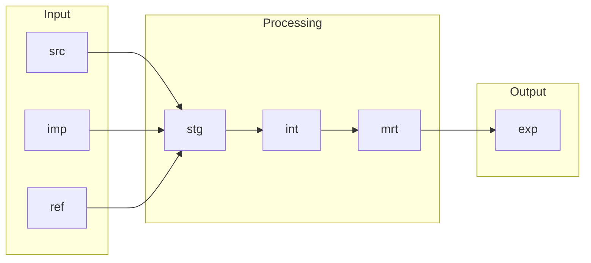
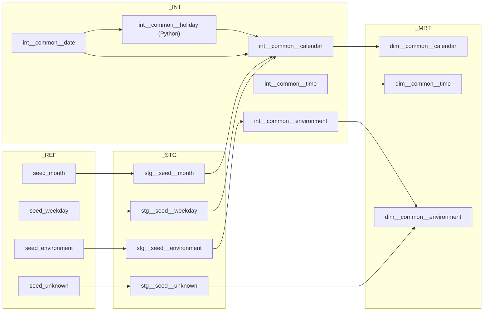

# Layer

Layers give the data inside a Project × Environment a logical and semantic structure. They say
what a dataset is for, how mature it is and who may rely on it. They do **not** represent
ownership or lifecycle boundaries, and they are not security boundaries on their own: access is
granted per layer through [Roles](role.md).

Layers are a convention. A Project picks the layers it needs, and the chosen set applies to
every Environment of that Project.

## The layers

One file per layer under `terraform/config/layers/`. The `code` becomes the schema name.

| Key (file) | `code` | Type | Purpose | `required` | `disabled` | Used by `example` |
|------------|--------|------|---------|------------|------------|-------------------|
| `source` | `src` | input | Actively collected raw data from source systems | yes | no | yes |
| `import` | `imp` | input | Received data contracts from other Projects' expose outputs | no | yes | no |
| `reference` | `ref` | input | Curated reference and lookup datasets used across models | no | no | yes |
| `preparation` | `prp` | processing | Initial cleansing and harmonisation of raw inputs | no | yes | no |
| `staging` | `stg` | processing | Mandatory landing layer for standardising and cleaning inputs | yes | no | yes |
| `integration` | `int` | processing | Reconciled and integrated entities, the business layer | no | no | yes |
| `mart` | `mrt` | processing | Analytics-ready models optimised for specific use cases | no | no | yes |
| `expose` | `exp` | output | Published outputs and cross-project contracts | yes | no | yes |
| `application` | `app` | output | Application-owned datasets that support products and apps | no | yes | no |
| `metadata` | `mtd` | operational | Run metadata written by the tooling (dbt run results, freshness) | no | no | yes |
| `temporary` | `tmp` | operational | Short-lived datasets for operations and intermediate work | no | no | yes |

```yaml title="terraform/config/layers/staging.yaml"
code: "stg"
name: "Staging Layer"
desc: "Mandatory landing layer for standardising and cleaning inputs"
type: "processing"
sort: 220
disabled: false
required: true
```

The `type` says how data moves through a Project. **Input** is where data enters the boundary:
`src` is what the Project collects itself, `imp` what it receives from another Project's `exp`,
`ref` curated lookup data. **Processing** cleans, integrates and models it (`prp`, `stg`,
`int`, `mrt`). **Output** is where data leaves as a contract: `exp` for other Projects and
downstream systems, `app` for applications that need read and write access. **Operational**
covers the bookkeeping that is not a modelling step: `mtd` for run metadata, `tmp` for
short-lived work that nothing may depend on.

`metadata` is one of the starter's additions to the platform model. `application`, `import` and
`preparation` ship disabled because no role grants anything on them yet: a project that lists
one gets a validator warning and no schema until an administrator adds an access tier under
`terraform/config/roles/` and flips the flag.

## How data flows



A model references only the layer directly below it, which is what keeps the graph readable.
The dbt side of that rule, with the materialization and naming conventions per layer, is the
[dbt style guide](../reference/dbt-style-guide.md). Cross-project sharing always runs from one
Project's `exp` into another Project's `imp`; a Project never reads another Project's
non-expose layers.

## What each layer holds here

`src`, Source
:   Raw data as the source system returned it, no business logic, not for direct consumption:
    the tables dlt loads as `<source>__<entity>`, such as `knmi__climate_hourly`, with dlt's
    own bookkeeping columns and state tables next to them. Renames, casts and fixes are
    staging's job. See [Ingestion](ingestion.md).

`imp`, Import
:   Data products received from other Projects, read-only, reshaped downstream. Distinct from
    `src` so that cross-project dependencies stay explicit. Not used by the example project.

`ref`, Reference
:   Small, stable, curated datasets: code lists, calendars, mappings. Here: the dbt seeds, each
    with a typed `stg__seed__<name>` model that downstream models reference instead of the
    untyped seed.

`prp`, Preparation
:   An optional cleansing step before staging. Enabled, but not used by the example project.

`stg`, Staging
:   The first transformed layer: typing, renaming, deduplication, unit conversion. One model
    per source table, no joins. `stg__knmi__climate_hourly` is the whole pattern: `t` in tenths
    of a degree becomes `temperature_celsius`, KNMI's hour `1..24` becomes an `observed_at`
    timestamp, `-1` for "less than 0.05 mm" becomes `0.05`.

`int`, Integration
:   Reusable, joined and enriched datasets that are not yet facts or dimensions, organised by
    domain rather than by source. Here: the common chain from `dbt_common` and the `weather`
    models of `dbt_example`.

`mrt`, Mart
:   The dimensional model: `dim__`, `fct__`, `brg__` and `agg__`. Here the weather star
    (`dim__weather__knmi_station`, `dim__weather__knmi_measurement_type`,
    `fct__weather__knmi_measurement`) next to the common dimensions below.

`exp`, Expose
:   The publication boundary. Whatever is here is a contract, and the owning Team keeps it
    backward compatible. Here: `exp__weather__station_weather`, a view that joins the star back
    into one flat row per station, hour and measurement type, with the `weather_dashboard`
    exposure as its declared consumer so lineage runs past the last model.

`app`, Application
:   Operational datasets for applications with CRUD access, separate from the analytical path.
    Disabled in the starter.

`mtd`, Metadata
:   Run metadata written by the tooling: the `pre__dbt__*` tables that the `dbt_common`
    `on-run-end` hook fills after every dbt run. See [Transformation](transformation.md).

`tmp`, Temporary
:   Ephemeral datasets with no guarantees and no dependants: stored dbt test failures, dlt's
    `merge` staging tables, and whatever an analyst or engineer creates and drops.

Every layer folder tags its models, so a whole layer selects at once:

```bash
just dbt ls --select tag:layer=stg
```

## Who writes what

| Layer | Written by | From |
|-------|-----------|------|
| `src` | dlt | `dlt_pipelines/pipelines/ingest/<source>/`, into the dataset `source_dataset()` returns |
| `ref` | `dbt seed` | `seeds/` |
| `stg`, `int`, `mrt`, `exp` | dbt models | `models/02_stg`, `03_int`, `04_mrt`, `05_exp` |
| `mtd` | the `dbt_common` `on-run-end` hook | `macros/dbt_artifacts/`, tables created on first use |
| `tmp` | dbt data tests, dlt | `+store_failures: true`; dlt's `merge` staging tables |

## In Snowflake

Every layer a project lists becomes one schema per project database, named `_<LAYER>` with the
code uppercased: `DB_EXAMPLE_DEV._SRC`, ..., `DB_EXAMPLE_PRD._TMP`. The leading underscore
marks a provisioned layer schema. In `dev` engineers work in personal copies of the same
layers, `<SNOWFLAKE_SCHEMA>_<LAYER>`, which Terraform provisions per engineer; every tool
implements that one rule, and
[Environment variables](../reference/environment-variables.md) has the details.

Roles name an [access tier](access.md) per layer and per environment (`privileges.layers` in
`roles/*.yaml`: `view`, `read`, `edit` or `full`). Each layer × tier is an access role
`AR_<PROJECT>_<ENV>__<LAYER>__<ACCESS>` holding the tier's privileges on the `_<LAYER>` schema
and on all current and future tables and views in it, and the project role inherits the one it
names. A layer can add privileges to a tier under `privileges` in its own file: the source
layer's stages, the temporary layer's scratch tables. A layer with no tier for a role is
invisible to that role.

## The common chain from dbt_common

`dbt_common` ships the dimensions every project needs and nobody wants to write twice. Its
models build as part of the project that installs it, in the same layers, grouped in Dagster
under `<project>/packages/dbt_common/`:



`int__common__date` generates one row per day from a fixed first year (2000) to ten years past
the current one, both `+meta` configs of the installing project; the first year is a literal on
purpose, because a start that slides with the clock silently drops its oldest year every
January. `int__common__calendar` decorates those days with ISO weeks, month and weekday labels
and the public holidays that `int__common__holiday` computes, and `int__common__time` is one
row per second of the day.

`stg__seed__unknown` is the reason a fact can always point somewhere: its rows `-1`, `-2` and
`-3` are the empty, unknown and not-applicable members that every dimension unions in.

## Related pages

- [Role](role.md) and [Access](access.md): who may read or write a layer
- [dbt style guide](../reference/dbt-style-guide.md): what may reference what, materializations,
  what each layer's models look like
- [Adding a dbt model](../build/adding-dbt-models.md): where a new model goes, step by step

Next: [Role](role.md).
