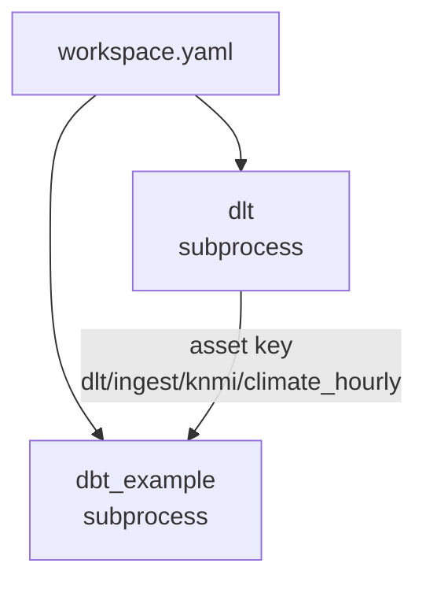

# Orchestration (Dagster)

Dagster is the control plane. Every dlt resource and every dbt model, seed and test is an
asset, organized in code locations that load independently. `just start` runs
`dagster dev -w workspace.yaml` on <http://localhost:3000>; the UI shows one asset graph across
all locations. Dagster reads the same `.env` as everything else, so it runs in whichever
environment the checkout is configured for.

## workspace.yaml

`workspace.yaml` at the repository root is the authoritative list of code locations. Each entry
names a Python module of the `orchestrator` package that exposes a top-level `defs`:

```yaml title="workspace.yaml"
load_from:
  - python_module:
      module_name: orchestrator.locations.dlt.definitions
      location_name: "dlt"

  - python_module:
      module_name: orchestrator.locations.dbt.dbt_example.definitions
      location_name: "dbt_example"
```

| Location | Module | Owns |
|----------|--------|------|
| `dlt` | `orchestrator.locations.dlt.definitions` | Every dlt load under `dlt_pipelines/pipelines/ingest/`, plus, per source, a job and its daily schedule, and a job for all with an opt-in schedule ([Jobs](#jobs)) |
| `dbt_example` | `orchestrator.locations.dbt.dbt_example.definitions` | The `dbt_example` project as assets, including the `dbt_common` models it builds, plus the jobs, schedule and sensor every dbt location gets ([Jobs](#jobs)) |

One location per concern: the ingestion package, and one per dbt project, which is one per
Project of the mesh. The file ends with a commented block for the next dbt project. A genuinely
separate Python concern is one more entry as well.

## Locations load in subprocesses and never import each other

`dagster dev` starts every location in its own subprocess. That gives parallel startup, a
per-location *Reload* button in the UI, and fault isolation: a broken dbt project does not take
the dlt assets down. The flip side is a rule. Location modules never import one another, and
shared code lives outside the location packages (`orchestrator.resources`,
`orchestrator.locations.dbt.shared`).



## Component trees

Neither location writes assets by hand. Both call `ComponentTree.from_module(...)`, which walks
a Python package, finds every `defs.yaml`, and builds the definitions those components declare.

### The dlt location

`src/orchestrator/locations/dlt/definitions.py` walks the whole `dlt_pipelines` package, so
`dlt_pipelines/pipelines/ingest/knmi/defs.yaml` (a `dagster_dlt.DltLoadCollectionComponent`) is
found without registration. Adding a source is adding a folder with a `defs.yaml`. The location
then merges in one job and one daily schedule per source folder, from the same `discover()`
that backs `just dlt list`, plus `job__dlt__ingest_all` and its opt-in schedule. New assets
join that job for free, because it selects by key prefix. See
[Ingestion](ingestion.md#the-dagster-component).

### The dbt locations

Every dbt location is two small files. `definitions.py` calls the shared factory with the
project name and its `defs` package:

```python title="src/orchestrator/locations/dbt/dbt_example/definitions.py"
from orchestrator.locations.dbt.dbt_example import defs as _defs_module
from orchestrator.locations.dbt.shared import build_dbt_defs

defs = build_dbt_defs("dbt_example", _defs_module)
```

`build_dbt_defs()` in `src/orchestrator/locations/dbt/shared.py` loads the component tree under
`defs/` and adds the location's jobs, schedule and sensor ([below](#jobs)), plus the `dbt`
resource their ops run through. The tree contains one component:

```yaml title="src/orchestrator/locations/dbt/dbt_example/defs/dbt/defs.yaml"
--8<-- "src/orchestrator/locations/dbt/dbt_example/defs/dbt/defs.yaml"
```

`prepare_project_cli_args` makes `dagster dev` run `dbt parse --quiet` whenever it loads or
reloads the location, so the manifest matches the SQL on disk. Every other load, including
`dagster definitions validate`, reads the manifest the last `dbt parse` wrote instead, which is
why `dbt deps` and a parse have to have run first: without `packages/` the parse fails and the
location shows an error. `just dbt-all deps` fixes it, and `just init` and `just check` run the
parse. Both paths read the same `dbt/<project>/target/manifest.json`, because
`DataMeshDbtProjectComponent` ignores the copy of the project that dagster-dbt otherwise
snapshots into `.local_defs_state/`. The Kubernetes image runs `dbt deps` and `dbt parse` when
it is built ([Kubernetes](../operate/kubernetes.md)), since nothing parses there on load.

The `select: "fqn:*"` in that file means every node. It is not a bare `*`, which dbt's CLI
expands to the file names in the project directory on Windows, and then selects nothing.

## Asset keys

| Kind | Key | Example | Group |
|------|-----|---------|-------|
| dlt resource | `dlt/ingest/<source>/<entity>` (from `defs.yaml`: `key_prefix` + lowercased resource name) | `dlt/ingest/knmi/climate_hourly` | `dlt/ingest/<source>` |
| dbt model, seed | `<project>/<path in the project>/<node name>`; nodes from a package get `<project>/packages/<package>/...` | `dbt_example/models/02_stg/knmi/stg__knmi__climate_hourly`, `dbt_example/packages/dbt_common/seeds/seed_month` | the key without its last segment: `dbt_example/models/02_stg/knmi` |
| dbt source | `config.meta.dagster.asset_key` from the source YAML | `dlt/ingest/knmi/climate_hourly` | the upstream asset's group |

The dbt keys come from `DataMeshDbtTranslator` in `src/orchestrator/locations/dbt/shared.py`:
the project name, the node's path inside the project, then its name. Nothing in the key depends
on the physical schema, so it is the same in every environment: `DBT_USERNAME_STG` in `dev` and
`_STG` in `prd` both show up under `dbt_example/models/02_stg/...`. The group is the key without
its last segment, which is what nests assets by project, package, layer and domain in the UI.
Search the catalog for the model name; in code the full key is
`AssetKey(["dbt_example", "models", "02_stg", "knmi", "stg__knmi__climate_hourly"])`.

## Lineage across code locations

The dlt asset and the dbt staging model live in different locations and different processes,
yet the graph shows `dlt/ingest/knmi/climate_hourly` feeding
`dbt_example/models/02_stg/knmi/stg__knmi__climate_hourly`. No import makes that happen; the key
does. The dbt source declares it:

```yaml title="dbt/dbt_example/sources/src_knmi.yml (excerpt)"
        config:
          meta:
            dagster:
              asset_key: ["dlt", "ingest", "knmi", "climate_hourly"]
```

Dagster resolves both locations' definitions into one global graph and joins on equal keys. The
same mechanism works in the other direction: a Python asset or a second dbt project that
depends on `dbt_example/packages/dbt_common/models/04_mrt/common/dim__common__calendar` names
that key and gets the edge. Two locations
declaring the same *materializable* key is an error; the project prefix keeps dbt keys apart,
so the reason only one project builds the `dbt_common` models is the tables, which would
otherwise be written twice into the same database.

## Jobs

Every job is named `job__<location>__<name>`, and nothing is written per instance: the dlt
location derives one job per source folder plus one for all, and every dbt location gets the
same set from `build_dbt_defs()`. Below, `<source>` is a folder under
`dlt_pipelines/pipelines/ingest/` and `<project>` a dbt location (`dbt_<project>` in
`workspace.yaml`). Adding a source or a project adds its jobs; nothing here changes.

| Job | Location | What it runs |
|-----|----------|--------------|
| `job__dlt__ingest_<source>` | `dlt` | Every asset with key prefix `dlt/ingest/<source>`: one source's load |
| `job__dlt__ingest_all` | `dlt` | Every asset with key prefix `dlt/ingest` |
| `job__<project>__build_all` | `<project>` | Every asset in the location (`AssetSelection.all()`): `dbt build` for the whole project, asset by asset, so a retry re-runs only what failed |
| `job__<project>__run_all` | `<project>` | The models (`resource_type:model`) without their checks: `dbt run`, no tests |
| `job__<project>__test_all` | `<project>` | Every asset check (`AssetSelection.all_asset_checks()`), no asset: `dbt test`, one check result per test |
| `job__<project>__seed_all` | `<project>` | The seeds (`resource_type:seed`) without their checks: `dbt seed` |
| `job__<project>__source_freshness` | `<project>` | `dbt source freshness`, then one observation per source on its asset with the `max_loaded_at` dbt found. A stale source is a warning; a `sources.json` dbt did not write fails the run |
| `job__<project>__build_fresher` | `<project>` | `dbt build --select source:<source>.<table>+ ...` for the sources whose observed `max_loaded_at` changed since its last successful run started (dbt's `source_status:fresher+`, with the event log as the state); nothing when none did. Launched by hand or by the sensor below, it works out the sources itself |

Every dbt job but the two freshness jobs is an asset job: the UI shows one materialization
per model or seed and one result per test, under the asset's *Checks*. The dbt integration runs
each as one `dbt build --select` of the selected nodes. Leaving the checks out of `run_all` and
`seed_all` turns dbt's indirect selection off, so no test runs. A run of checks only, `test_all`
or *Execute checks* in the UI, runs `dbt test` instead (`DataMeshDbtProjectComponent.get_cli_args()`
in `shared.py`): nothing is built, and every selected test runs, where `dbt build` would skip the
tests on everything downstream of a test that fails with severity `error`.

The freshness jobs are one op each. `source_freshness` runs `dbt source freshness` and records
observations, never a materialization. `build_fresher` is an op because what it builds is only
known once it runs, and an asset job's selection is fixed at launch; it streams dbt's results
through the same translator as the assets, so the UI shows the same materializations and check
results, on the same asset keys. All of them take the `dbt` resource, a `DbtCliResource` pointed
at the component's project, so every job runs the same project with the same profiles.

That split decides what a retry costs. *Re-execute, from failure* on a finished run is the
retry path, and there is no separate retry job. On the asset jobs it re-runs only the failed
and never-attempted assets, which the dbt integration translates into a `dbt build --select` of
exactly those models (failed dbt tests appear as failed asset checks on a model that succeeded,
and come along). On the dlt jobs it re-runs only the resources that failed, and because every
pipeline merges on a primary key, an overlapping window is safe to pull twice. The freshness
jobs are a single op, so they re-run the whole dbt command; for `build_fresher` that is every
source that got fresher since its last success, as a failed run moves nothing.

## Schedules and sensors

The dlt location derives a daily schedule per source, plus an opt-in one for every load at
once; each dbt location carries one freshness chain, built by
`src/orchestrator/locations/dbt/source_freshness.py`. Together they run the platform on their
own: the load lands, the next freshness check sees it, the sensor rebuilds its downstream.

| Definition | Interval | Does |
|---|---|---|
| `schedule__dlt__ingest_<source>` | daily at 06:00 UTC (`0 6 * * *`) | Launches `job__dlt__ingest_<source>`; these carry the daily load, one run per source |
| `schedule__dlt__ingest_all` | same cron, stopped everywhere | Opt-in: launches `job__dlt__ingest_all`, every load in one run. Start it and stop the per-source schedules, or every load runs twice |
| `schedule__<project>__source_freshness` | every hour (`0 * * * *`) | Launches `job__<project>__source_freshness` |
| `sensor__<project>__source_freshness` | every 5 minutes | Applies the rule of `job__<project>__build_fresher` and launches it when any source got fresher, once per change set (a failed run is not relaunched until a source moves again), and never while a run of it is in progress |

A source takes part when its YAML has a `freshness` block and a `loaded_at_field` or
`loaded_at_query`; `src_knmi.yml` derives one from dlt's `_dlt_load_id`, and dbt skips the
sources that have neither. Until `build_fresher` first succeeds, every observed source counts
as fresher and the whole downstream builds once; from then on only what changed. The jobs and
the sensor meet in the event log and the run history, not in dbt's `sources.json`: the
observations sit on the source's asset (the dlt asset, through the shared key), so the history
of every check shows there too, and each job can run in a pod of its own on Kubernetes while the
sensor runs in the code server, all reading the same instance storage.

All of them start **stopped** in `dev` and `local` (`SnowflakeSettings.is_personal`), so nothing
fires by itself on a laptop; switch them on under *Automation* in the UI to try the chain. In
every other environment they start running, except `schedule__dlt__ingest_all`, which is the
opt-in and starts stopped everywhere.

## The local instance

`DAGSTER_HOME` is `.dagster/` inside the repository (exported by the justfile and `.envrc`).
`.env` is read once when `dagster dev` starts and inherited by every code server and run, so an
edited `.env` needs `just stop && just start`; reloading a code location does not re-read it.
Run history and event logs land there, git-ignored; the one versioned file is the instance
config:

```yaml title=".dagster/dagster.yaml"
--8<-- ".dagster/dagster.yaml"
```

Runs start immediately in a subprocess with no limit on concurrent runs; a limit needs the
`QueuedRunCoordinator` and the daemon. In `local` mode that matters more than it sounds: the
DuckDB file allows one writer at a time, so two runs that touch it together, or `just check`'s
sqlfluff lint while a run is active, fail with a lock error. Fine for one engineer working alone.
Deleting `.dagster/` (keep `dagster.yaml`) resets your run history and nothing else.

`pyproject.toml` also carries a `[tool.dg]` block for Dagster's `dg` CLI. Its `defs_module`
points at the deliberately empty `orchestrator.defs` package so the component cache has one
home; the real locations are the ones in `workspace.yaml`.

## Working with it

```bash
just start                                                         # UI on :3000, Ctrl+C stops
just stop                                                          # stop dagster dev on port 3000; another program there is reported, not killed
just validate                                                      # load every location, no UI
just dagster asset list -m orchestrator.locations.dlt.definitions  # any Dagster CLI command
just dagster job list -m orchestrator.locations.dlt.definitions    # the jobs of one location
```

`just validate` is the check to run after touching `src/`, `dlt_pipelines/`, `dbt/` or
`workspace.yaml`: it loads every location exactly like `just start` does and fails on import
errors, broken `defs.yaml` files and dbt parse errors. CI runs the same command with
`DBT_TARGET=local`, since it has no `.env`; do the same locally while yours is still empty.

## Related pages

- [Ingestion](ingestion.md) and [Transformation](transformation.md): what the two locations load
- [Adding Python assets](../build/adding-python-assets.md): merging a plain `@asset` into a location
- [Adding a project](../build/adding-projects.md): the third code location
