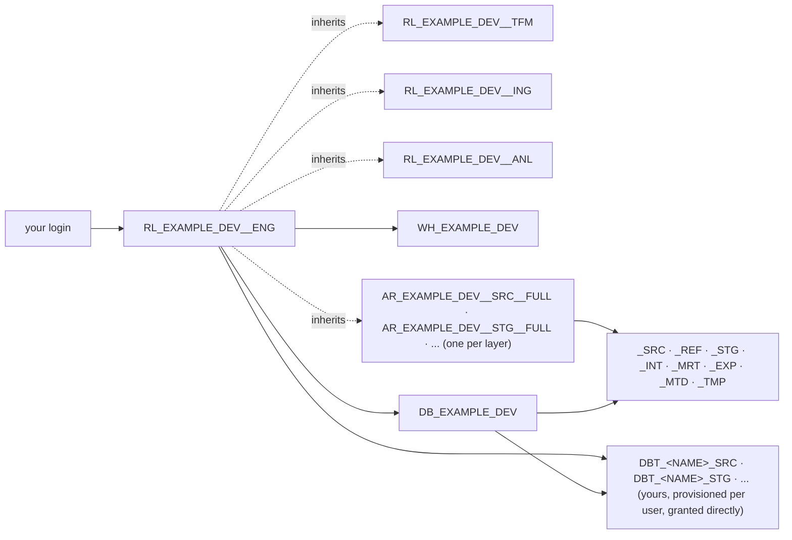
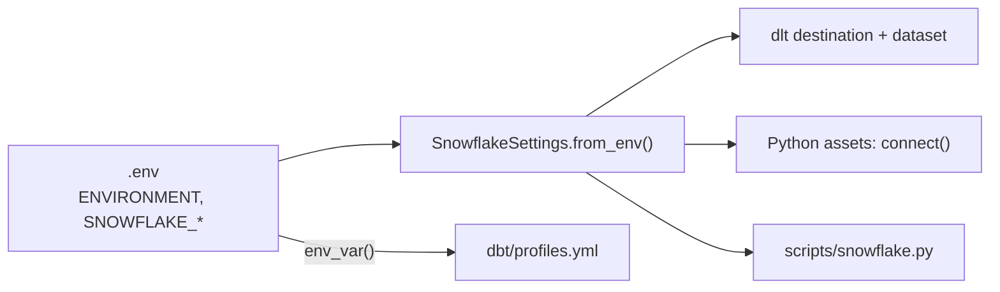

# Snowflake

Snowflake is the data plane: one database per Project and Environment, one schema per Layer,
roles with an access role per layer, warehouses per compute profile. Terraform creates all of
it from `terraform/config/`, everything in the repo authenticates with a key pair, and one
Python object reads the connection settings. This page is what exists and how the tools reach
it; the administrator's steps are on
[Snowflake provisioning](../operate/snowflake-provisioning.md).

## What Terraform creates

For every project in `terraform/config/projects/` and each of its environments:

| Concept | Snowflake object | Example project, `dev` |
|---------|------------------|------------------------|
| Project × Environment | database `DB_<PROJECT>_<ENV>`, `PUBLIC` schema dropped | `DB_EXAMPLE_DEV` |
| Layer | schema `_<LAYER>` in that database | `_SRC`, `_REF`, `_STG`, `_INT`, `_MRT`, `_EXP`, `_MTD`, `_TMP` |
| Role | account role `RL_<PROJECT>_<ENV>__<PURPOSE>` with `USAGE` on the database, grants per warehouse, one access role per layer, and inheritance | `RL_EXAMPLE_DEV__ENG`, `RL_EXAMPLE_DEV__ANL`, `RL_EXAMPLE_DEV__ING`, `RL_EXAMPLE_DEV__TFM` |
| Layer × Access | account role `AR_<PROJECT>_<ENV>__<LAYER>__<ACCESS>` holding the tier's privileges on the layer schema (all and future tables, views, ...), four per layer | `AR_EXAMPLE_DEV__SRC__FULL`, `AR_EXAMPLE_PRD__MRT__READ` |
| Compute | warehouse `WH_<PROJECT>_<ENV>[__<COMPUTE>_<SIZE>]` | `WH_EXAMPLE_DEV` (X-Small, auto-suspend 60 s, created suspended) |
| dlt load stage | internal stage `ST_DEFAULT` with a directory table in every source-layer schema, shared and personal | `_SRC.ST_DEFAULT`, `DBT_USERNAME_SRC.ST_DEFAULT` |
| User | `GRANT ROLE ... TO USER`, and the user itself when `create: true` | `username@example.com` gets `RL_EXAMPLE_DEV__ENG` |
| User × engineer role in `dev` | personal schemas `<PREFIX>_<LAYER>`, one per layer (`terraform/personal.tf`) | `DBT_USERNAME_SRC`, `DBT_USERNAME_STG`, ... |

The example project has two environments, so the same set exists once more with `PRD`. Nothing
is shared between the two. Each database keeps one day of Time Travel, or the
`data_retention_days` its environment file sets, which its schemas inherit, and carries
`prevent_destroy`, so no plan drops it by accident.

Terraform connects through Snowflake's system roles, so every object has the owner Snowflake
recommends: `SYSADMIN` creates and owns the databases, schemas, stages and warehouses,
`SECURITYADMIN` the roles and every grant, `USERADMIN` the users (`terraform/providers.tf`).
Every project role is granted to `SYSADMIN`, the recommended role hierarchy.

Privileges on the layer schemas do not sit on the project roles. They sit on access roles, one
per layer and tier, which the project roles inherit: `read` on `_MRT` is
`AR_EXAMPLE_PRD__MRT__READ`, held by both `RL_EXAMPLE_PRD__ENG` and `RL_EXAMPLE_PRD__ANL`. A
layer can add to a tier, which is how the source layer carries stage privileges and the
temporary layer becomes scratch space. Every tier and grant: [Access](access.md) and
[Role](role.md).



Every object name is built from the `code` fields of the YAML, uppercased; the patterns are in
[Naming](../reference/naming.md).

## Personal schemas in development

Development is shared: everyone who holds `RL_EXAMPLE_DEV__ENG` works in `DB_EXAMPLE_DEV`.
Terraform gives every user with that role a copy of each layer (`terraform/personal.tf`, driven
by the `personal` block in `roles/engineer.yaml`): `<PREFIX>_SRC`, `<PREFIX>_STG`, ..., owned by
`SYSADMIN`, with the engineer role's privileges on them and a load stage of their own in
`<PREFIX>_SRC`. The engineer role cannot create schemas itself, so a missing schema means the
user's file has not been applied yet. `<PREFIX>` is `schema_prefix` from that file, or `DBT_`
plus the part of the login before the `@` (`DBT_USERNAME` for `username@example.com`), and each
engineer carries it in `.env` as `SNOWFLAKE_SCHEMA`.

From then on dlt loads into `DBT_USERNAME_SRC`, dbt builds `DBT_USERNAME_STG` and friends, and
the metadata upload writes `DBT_USERNAME_MTD`, while the provisioned `_<LAYER>` schemas of
`DB_EXAMPLE_DEV` stay untouched by local runs. `tst`, `acc` and `prd` know no personal schemas;
there the same code writes to `_<LAYER>`. The mapping lives in
[Environment variables](../reference/environment-variables.md), including what a blank prefix
does.

The prefix keeps people apart, it does not lock them out: the privileges go to the shared
engineer role, so engineers can read and write each other's personal schemas.

!!! tip "Qualify with the schema, not the database"
    Your session database is already the project database, so `dbt_username_stg.stg__knmi__climate_hourly`
    is enough. Snowflake folds unquoted identifiers to uppercase, so the case you type is free.

## Key-pair authentication

No passwords in files, no MFA prompt on every run. Every connection from this repo, whether a
person's or a service user's, uses an RSA key pair.

People
:   `just sf setup` (`scripts/snowflake.py`) logs you in once interactively (browser, or
    `--auth password` for password plus MFA), generates an RSA 2048 key pair under
    `~/.snowflake/keys/<account>__<user>.p8` and `.pub`, registers the public key on your own
    user with `ALTER USER ... SET RSA_PUBLIC_KEY` (unless that slot already holds it; another
    key there is replaced only when you confirm), verifies a key-pair connection, and writes
    the settings to `.env`: role, warehouse and database from the project roles granted to you,
    never from the login session. `--slot 2` uses `RSA_PUBLIC_KEY_2` for rotation,
    `--passphrase` encrypts the private key. The walkthrough is
    [Snowflake authentication](../start/snowflake-auth.md).

Service users
:   The ingest and transform roles of a deployed environment are held by service users. An
    administrator creates the user by hand (`CREATE USER <login> TYPE = SERVICE`), generates its
    key pair with `just sf keygen <name>`, which prints the public key body, registers it with
    `ALTER USER <login> SET RSA_PUBLIC_KEY = '...'`, and grants the roles through a
    `create: false` file in `terraform/config/users/`. The Terraform user itself is bootstrapped
    the same way, with its key going into `modules/snowflake/init.sql`. It holds `SYSADMIN`,
    `SECURITYADMIN` and `USERADMIN`, so encrypt its key and restrict where it logs in from
    ([Securing the Terraform user](../operate/snowflake-provisioning.md#securing-the-terraform-user)).

The private key path, the passphrase and the rest of the connection are `.env` variables;
`.env`, `*.p8` and `*.pub` are git-ignored, and `just sf setup` makes the private key and `.env`
readable by you only (mode 600, or an owner-only ACL on Windows). A deployed environment fills
the same variables with the service user's key and `RL_<PROJECT>_PRD__TFM` or `__ING`. Every
variable is on [Environment variables](../reference/environment-variables.md).

## One settings reader

`SnowflakeSettings` in `src/orchestrator/resources/snowflake.py` is the only code that reads the
`SNOWFLAKE_*` variables and `ENVIRONMENT`. It is a frozen dataclass with one field per variable;
`from_env()` fills it from the environment (blank values keep the field default) and `missing()`
lists the required ones that are not set. From there, each tool gets the shape it needs:

| Method | Returns | Used by |
|--------|---------|---------|
| `schema_for_layer(layer)` | The layer's schema for this environment | dlt's `source_dataset()`, `just sf check` |
| `connection_kwargs()` / `connect()` | Arguments for `snowflake.connector.connect`, with the private key loaded as unencrypted PKCS#8 DER | `scripts/snowflake.py`, Python assets |
| `dlt_credentials()` | The dict dlt's Snowflake destination expects | `dlt_pipelines/utils/destination.py` |

dbt does not go through Python. `dbt/profiles.yml` reads the same variable names with
`env_var()` for every target, which is why the list above and the profile never disagree. Open a
connection in asset code through `connect()` rather than assembling one by hand.



Connections through the Snowflake connector identify themselves with the application name
`DATA_MESH_STARTER`; dbt and dlt bring their own. dbt runs tag their queries with
`dbt_invocation_id:<id>`, so the Snowsight query history filters cleanly.

## Checking your connection

```bash
just sf check                                            # who am I, which schemas exist
just sf query "SELECT CURRENT_ROLE(), CURRENT_DATABASE()"
just info                                                # .env and key status without connecting
```

`check` connects with the key pair and prints organization, account, user, role, warehouse,
database, schema and version, then the schemas in your database and the layer schemas your
`ENVIRONMENT` resolves to. If it fails,
[Troubleshooting](../start/troubleshooting.md) lists the usual causes.

## Related pages

- [Snowflake provisioning](../operate/snowflake-provisioning.md): the administrator runbook
- [Layer](layer.md), [Role](role.md), [Access](access.md): the model behind these objects
- [Snowflake authentication](../start/snowflake-auth.md): the one-time setup, step by step
